# Docker+MySQL

设备信息

CentOS Stream 10	3核4g	192.168.253.135

docker29.8.1

## 准备环境

当前设备我以前已经安装过MySQL9.7，且还在运行中

先看一眼

```shell
systemctl status mysqld
```

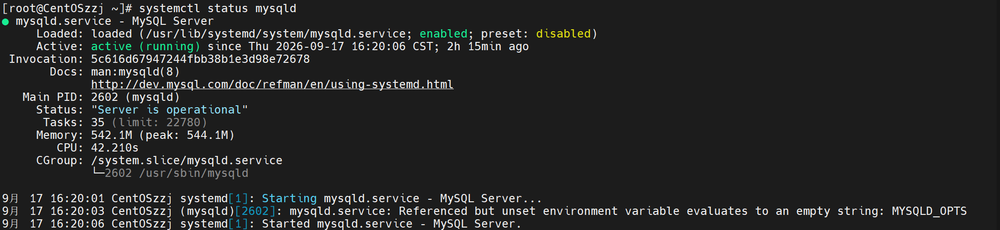

还在运行中，3306端口会被占用

### 查看端口

看一看端口

```shell
ss -ltnp | grep "mysql"
```

| 参数 | 含义                                                         |
| ---- | ------------------------------------------------------------ |
| `-l` | listen，只看**正在监听**的套接字（服务端）                   |
| `-n` | numeric，端口和 IP 都显示**数字**，不做 DNS/服务名反查（快，而且不会把 3306 显示成 `mysql`） |
| `-t` | tcp，只看 TCP                                                |
| `-p` | process，显示**是哪个进程**占的（需要 root 权限才看得到）    |

可以看见3306端口确实被占用

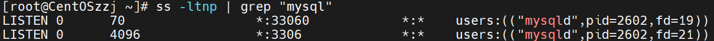

### 关闭原机MySQL

现在关闭原来的mysql服务

```shell
systemctl stop mysqld	#停止服务
systemctl disable mysqld	#关闭开机自启
```

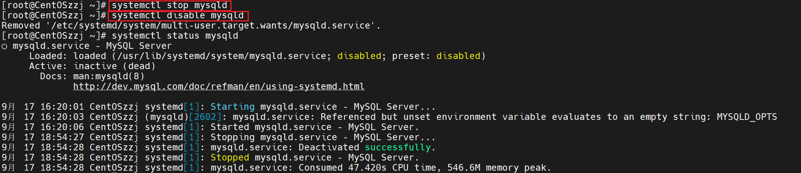

### 配置镜像源

先查看当前镜像源

```shell
cat /etc/docker/daemon.json
```

备份当前镜像文件

```shell
cp /etc/docker/daemon.json /etc/docker/daemon.json.bak
```

找到以下镜像源

```shell
https://docker.1ms.run
```

试试通不通

```shell
curl -sS -i -m 5 https://docker.1ms.run/v2/ | head -20
```

| `-s`   | `--silent`     | **静默模式**：不显示进度条、不显示错误 |
| ------ | -------------- | -------------------------------------- |
| `-S`   | `--show-error` | **出错时仍要显示错误**（配合 `-s` 用） |
| `-i`   | `--include`    | **输出里包含响应头**（默认只输出正文） |
| `-m 5` | `--max-time 5` | **整个请求最多 5 秒**，超时强制断开    |

返回的结果

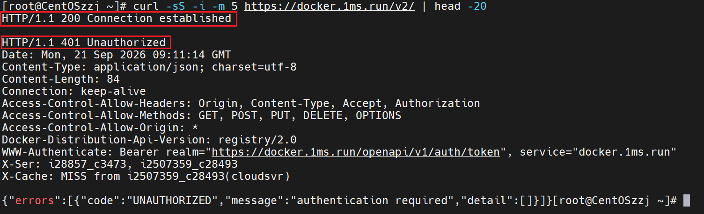

返回了200和401表示成功了

写入配置

```shell
vim /etc/docker/daemon.json
```

```shell
{
"registry-mirrors": ["https://docker.1ms.run"]
}
```

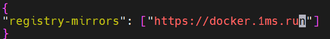

重载镜像，重启docker

```shell
systemctl daemon-reload
systemctl restart docker
```


## 寻找镜像

打开https://hub.docker.com/

搜索mysql

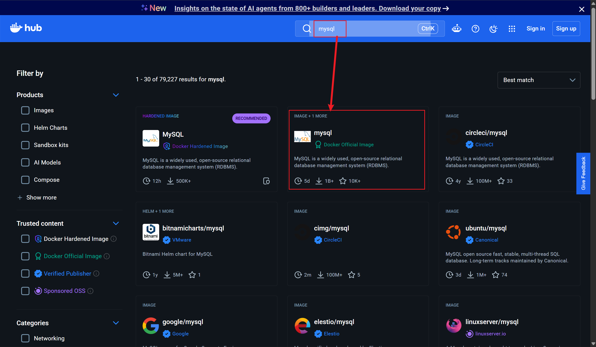

下载中间这个，左边哪个不建议下

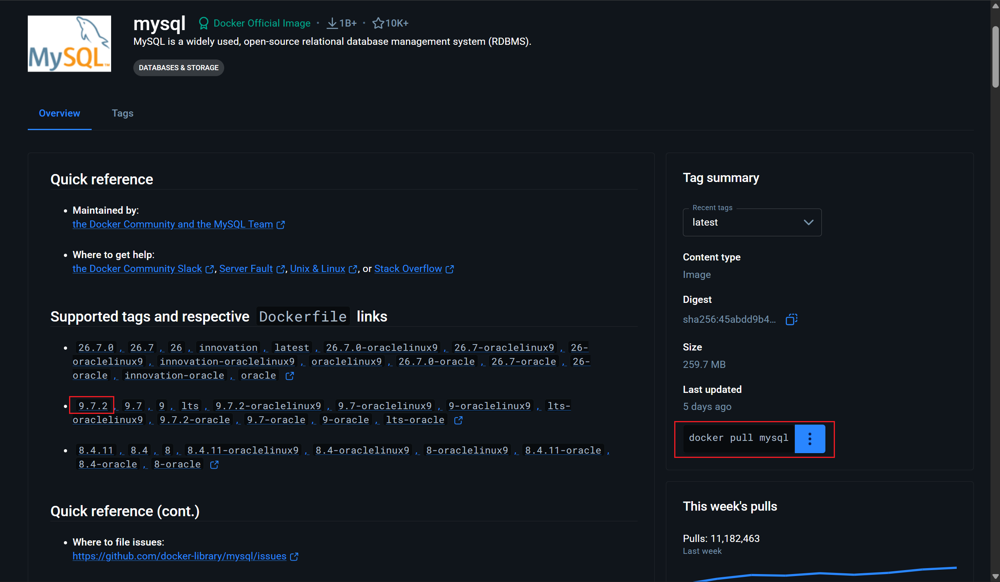

### 拉取镜像

拉取9.7.2的版本

```shell
docker pull mysql:9.7.2
```

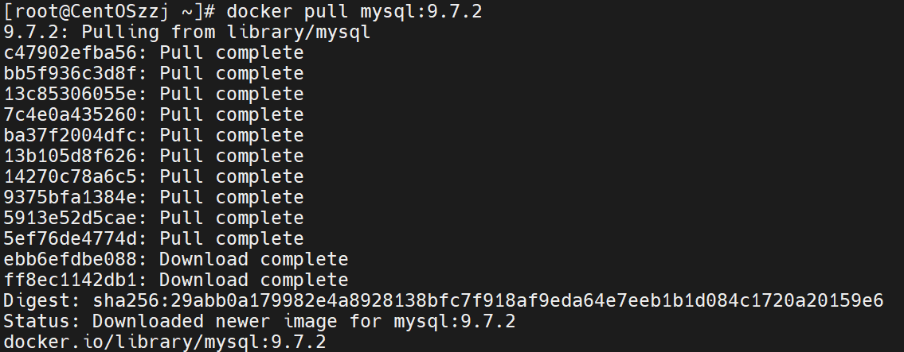

查看镜像

```shell
docker images
```

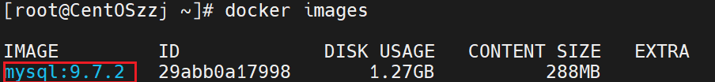

已经下载进来了

## 容器启动

现在开始在容器里启动mysql

docker run运行容器

-d后台运行

--name容器命名为mysql-test

-e加一个MYSQL_ROOT_PASSWORD=123456的环境变量，设置root密码为123456

-p端口映射主机3306映射容器3306

启动镜像选择mysql:9.7.2

```shell
docker run -d --name mysql-test -e MYSQL_ROOT_PASSWORD=123456 -p 3306:3306 mysql:9.7.2
```

执行完后，会出现一串字符，是容器id

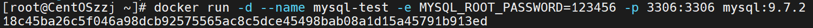

查看一下容器进程

```shell
docker ps -a
```

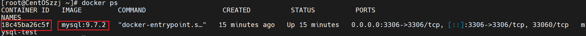

## 进入容器

docker exec 在容器里执行命令

-i表示交互式

-t表示分配一个终端

进入mysql-test容器

执行的命令是mysql -uroot -p123456

```shell
docker exec -it mysql-test mysql -uroot -p123456
```

执行完成后，成功登录进入容器的mysql

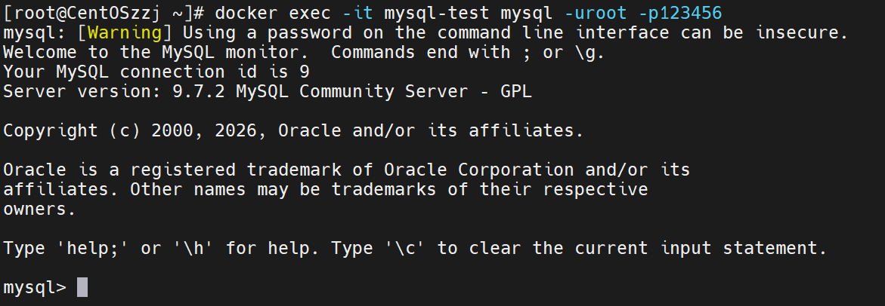

也可以远程登录

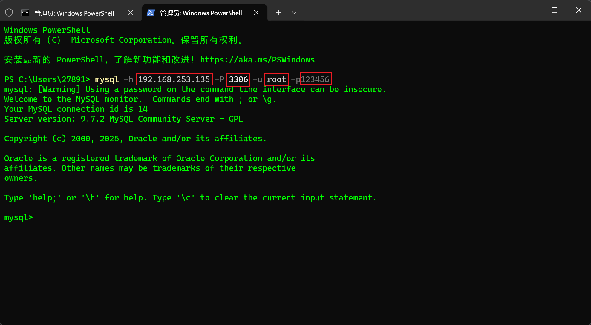
