# Docker

## 安装

打开Docker官网：https://www.docker.com/

将进入相关文档页面

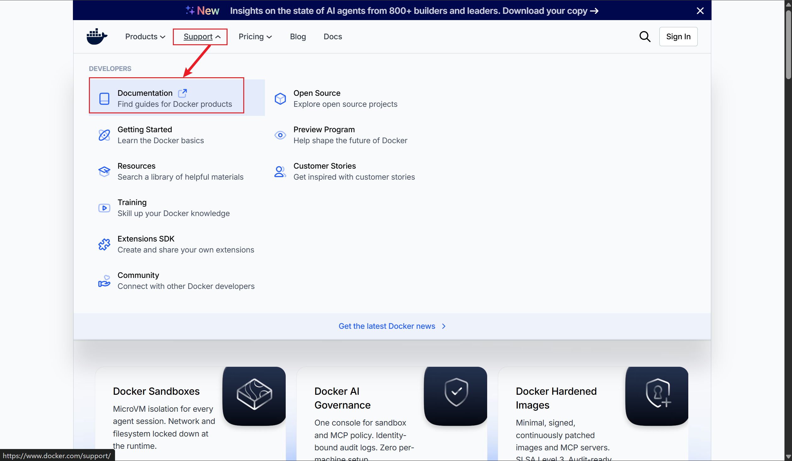

找到Docker的安装文档

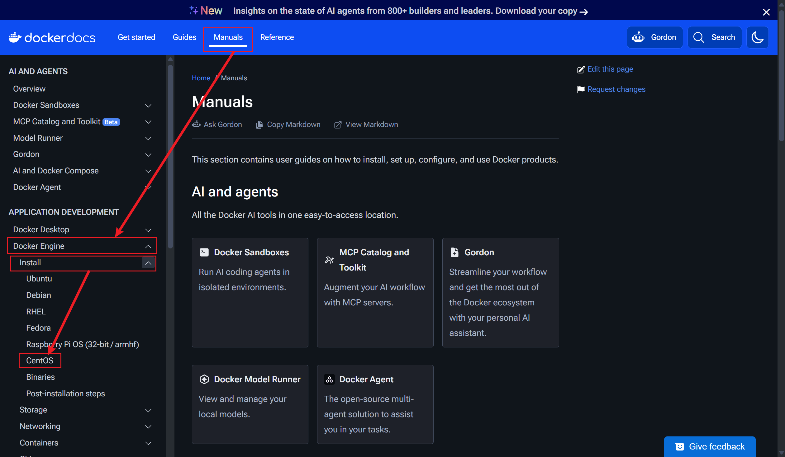

### 清除冲突

阅读文档后，先删除相关的冲突软件包

```shell
sudo dnf remove docker \
                  docker-client \
                  docker-client-latest \
                  docker-common \
                  docker-latest \
                  docker-latest-logrotate \
                  docker-logrotate \
                  docker-engine
```

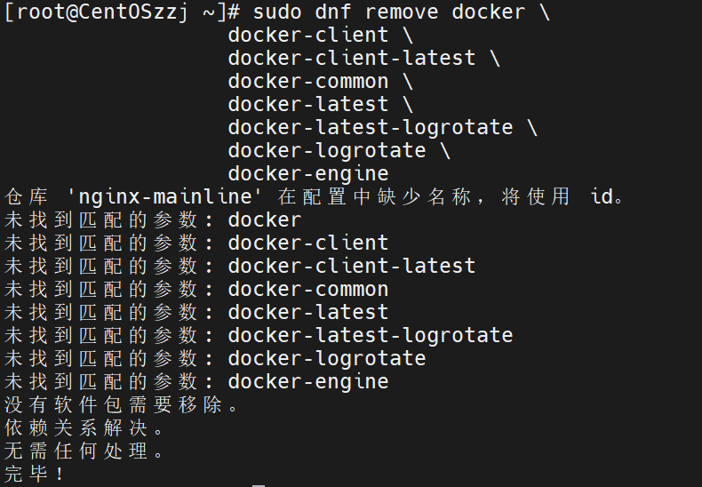

### 使用rpm仓库安装

```shell
sudo dnf -y install dnf-plugins-core
sudo dnf config-manager --add-repo https://download.docker.com/linux/centos/docker-ce.repo
```

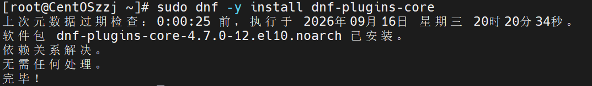


安装最新版本

```shell
sudo dnf install docker-ce docker-ce-cli containerd.io docker-buildx-plugin docker-compose-plugin
```

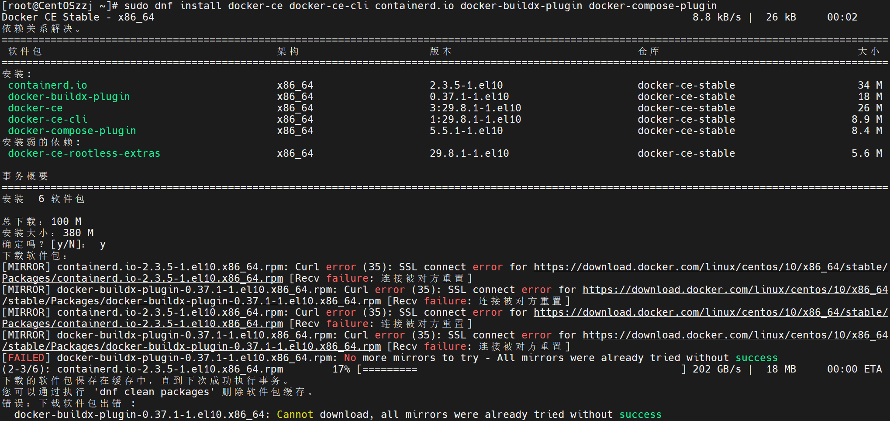

下载报错，被墙挡住了  :(

再试一次

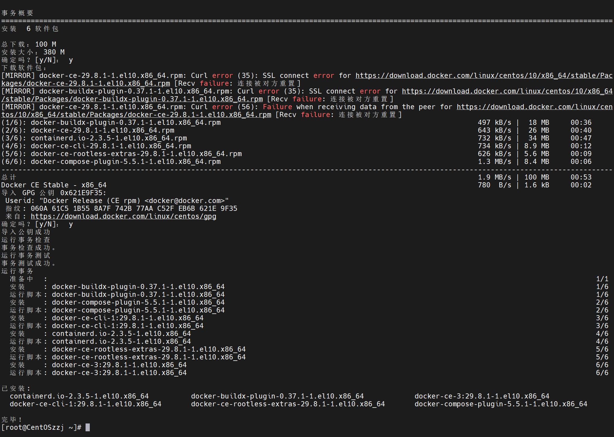

竟然成功了

### 验证安装

```shell
 docker -v
 docker images
```

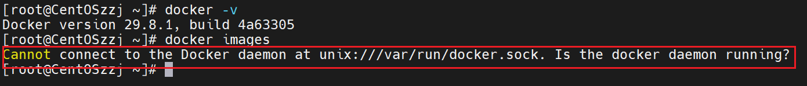

docker已经下载但无法运行

启动docker服务

```shell
systemctl start docker
```

又报错

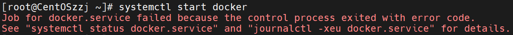

### 安装xt_addrtype模块

系统缺少内核模块 **`xt_addrtype`**，`xt_addrtype` 这个模块，在 **RHEL 10 / CentOS Stream 10** 上被打包进了 **`kernel-modules-extra`**，而**该包不属于默认安装**。

```shell
sudo dnf install -y kernel-modules-extra
```

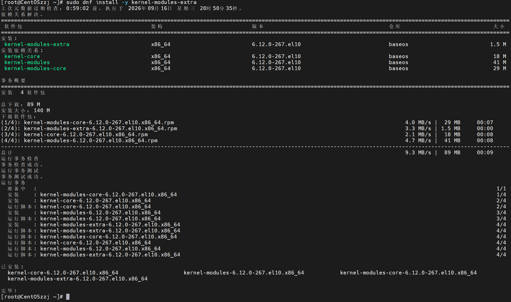

### 检查xt_addrtype模块

```shell
modinfo xt_addrtype
```

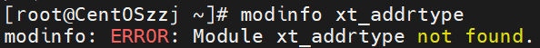

没找到模块

```shell
uname -r
rpm -q kernel-modules-extra
```

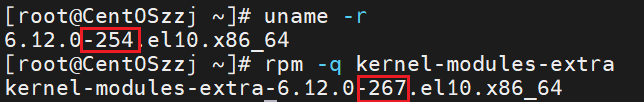

版本对不上，正在运行的是254，应该要跳到267

检查一下已安装的包

```shell
rpm -q kernel                 # 应该能看到 6.12.0-267.el10.x86_64
ls /boot/vmlinuz-*            # 确认 /boot 里有对应的内核文件
sudo grubby --default-kernel  # 看默认启动项指向哪个内核
```

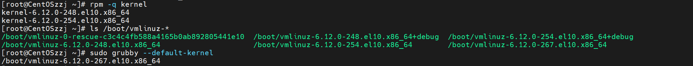

检查发现只安装了248和254，没有267

但boot目录有个 267 的内核文件

默认启动项已经指向 267

查看详细的安装

```shell
rpm -qa 'kernel*' | sort
```

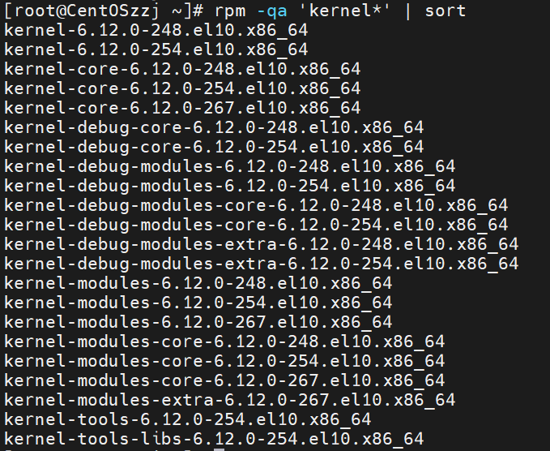

看 267 和 254 的对比：

| 组件                       | 248  | 254（正在跑） | 267   |
| -------------------------- | ---- | ------------- | ----- |
| `kernel`（元包）           | ✓    | ✓             | **✗** |
| `kernel-core`              | ✓    | ✓             | ✓     |
| `kernel-modules`           | ✓    | ✓             | ✓     |
| `kernel-modules-core`      | ✓    | ✓             | ✓     |
| **`kernel-modules-extra`** | ✗    | **✗**         | **✓** |

看来是没装267的元包

补一下

```shell
sudo dnf install -y kernel-6.12.0-267.el10
```

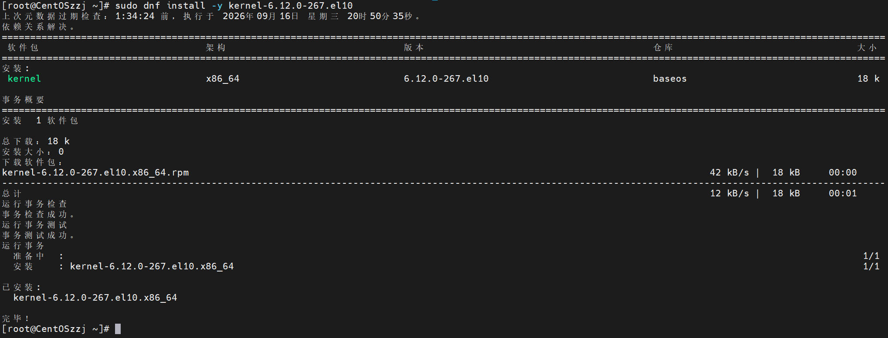

### 重启虚拟机

```shell
sudo reboot
```

再次验证docker

```
systemctl status docker
```

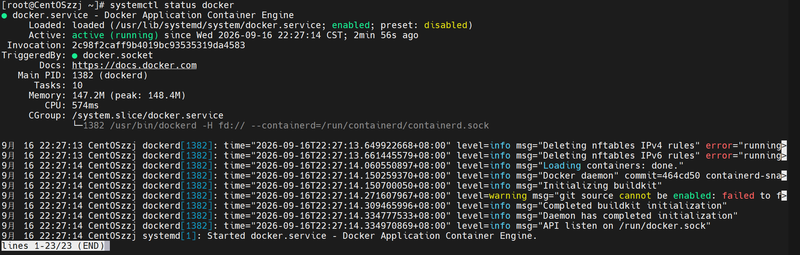

docker安装成功