# MySQL

## 安装

为了方便，先切换到root用户

```shell
su - root
```

输入密码即可切换到root用户

CentOS的yum仓库中没有MySQL程序（自带的是MariaDB，属于MySQL的分支）

### 寻找MySQL官方yum仓库

打开MySQL官网

选择“下载”

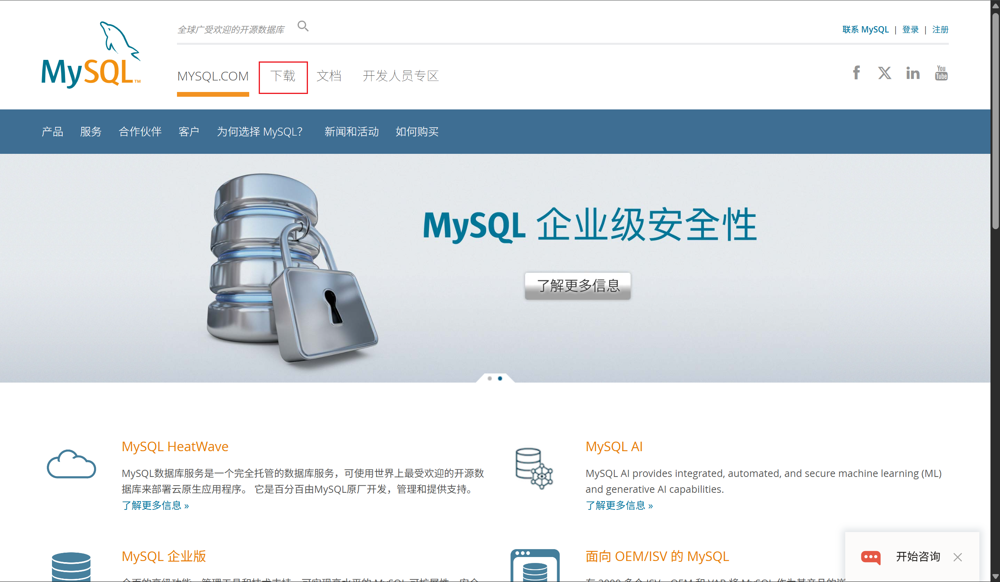

选择“社区版”

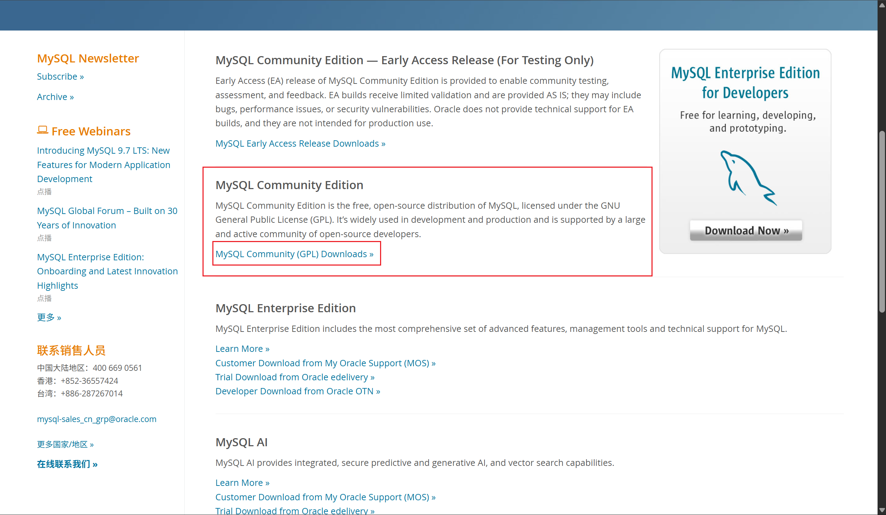

因为是CentOS，选择yum仓库

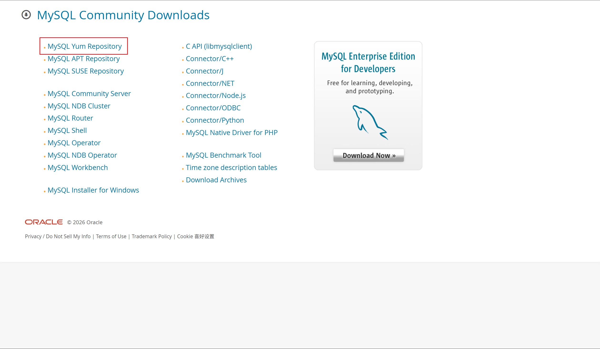

CentOS 10基于Red Hat，选择10版本，里面有MySQL8.4和MySQL9.7

这里以9.7为例，选择“下载”

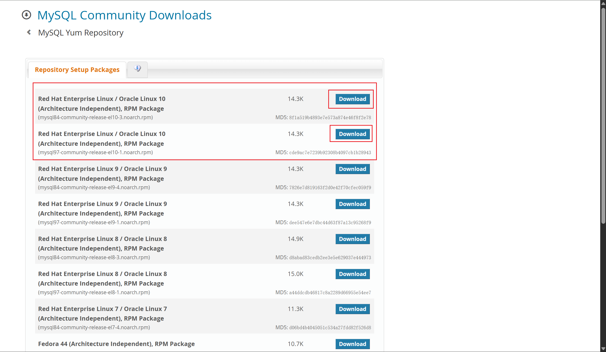

右键“下载”，复制链接地址

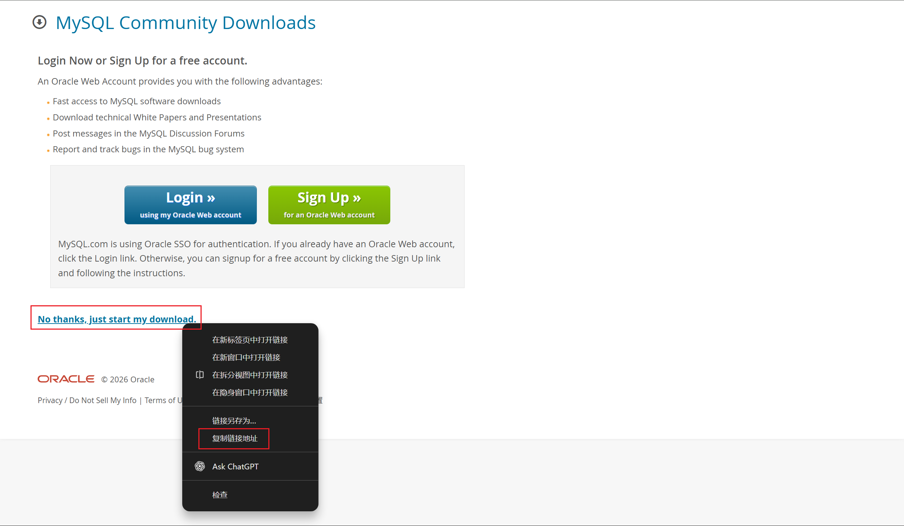

回到CentOS里

添加刚才复制的官方源

```shell
yum -y install https://dev.mysql.com/get/mysql97-community-release-el10-1.noarch.rpm
```

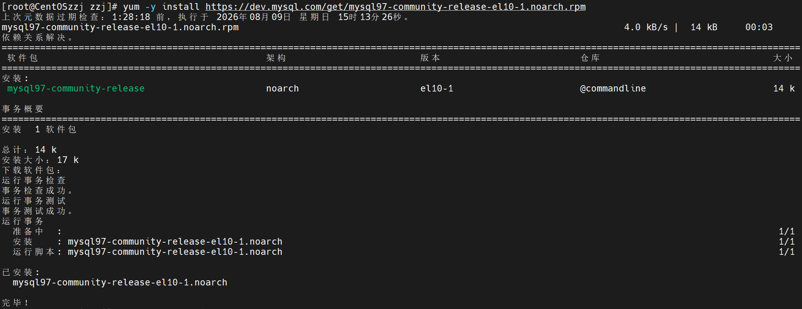

查看官方源是否启用

```shell
yum repolist enabled | grep mysql
```

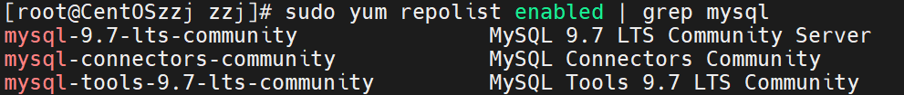

`mysql-9.7-lts-community`：MySQL 9.7 服务器本体

`mysql-connectors-community`：各种语言连接器

`mysql-tools-9.7-lts-community`：mysqlbackup、mysqlrouter 等工具

已经启用

### 开始安装MySQL服务

```shell
yum -y install mysql-community-server
```

结果发现有错误

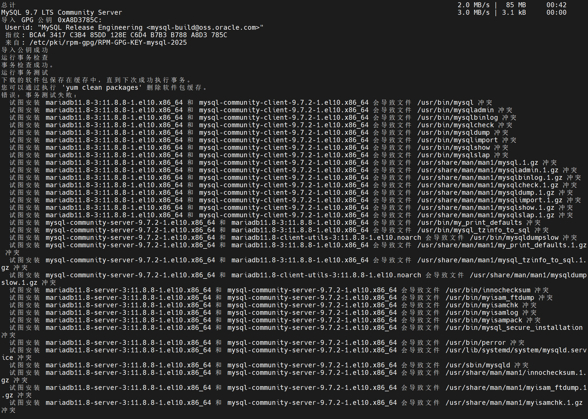

CentOS Stream 10 自带的 **MariaDB 11.8**（AppStream 仓库里的 `mariadb11.8` 系列）也被 yum 选进了同一笔事务

- MariaDB 是 MySQL 的分支，两边提供**完全相同的命令和文件**：`/usr/bin/mysql`、`/usr/sbin/mysqld`、`/var/lib/mysql`、systemd 服务 `mysqld.service` 等
- 两个包都想装这些文件，所以事务测试时报“会导致文件 xxx 冲突”，yum 直接拒绝执行

依赖解析时，MariaDB 服务器（`mariadb11.8-server` 等）被当作 MySQL 9.7 的**弱依赖（weak dependency）**拉进来，两边提供相同的命令和文件，导致冲突；`mariadb-connector-c` 只是连接库，本身不冲突。装的时候关掉弱依赖就行：

```shell
yum -y install mysql-community-server --setopt=install_weak_deps=False
```

--setopt=install_weak_deps=False

临时修改 yum 的一个配置项：**本次安装不装“弱依赖”**

执行后即可安装完成

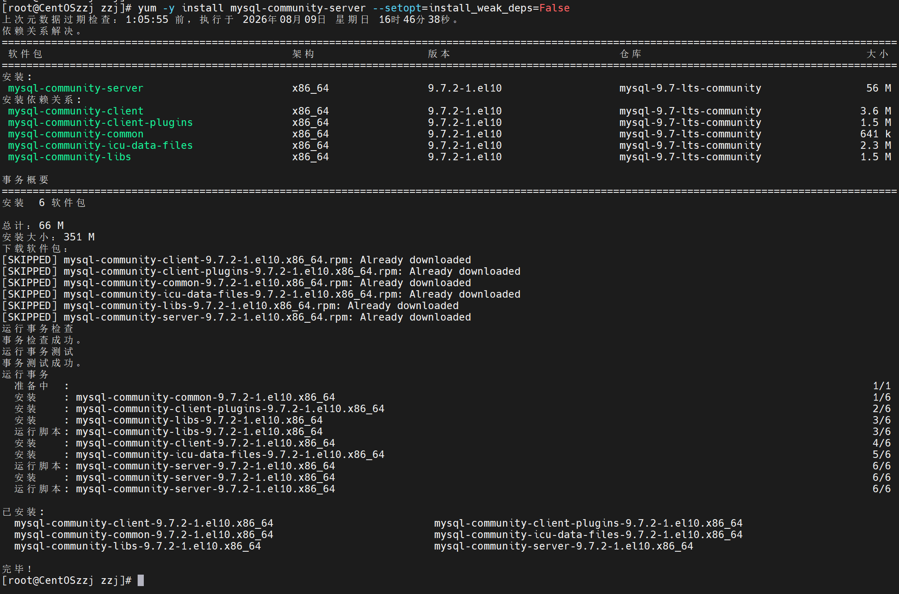

至此，MySQL就安装完了

### 配置开机自启动

开启MySQL服务，并开启开机自启

检查状态

```shell
systemctl start mysqld
systemctl enable mysqld
systemctl status mysqld
```

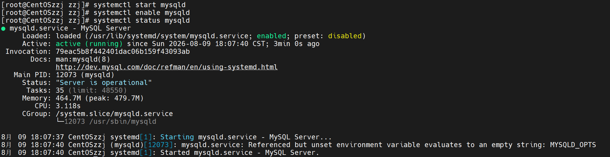

可见，服务已经开启，正在运行中

## MySQL用户配置

### 寻找临时登录密码

MySQL安装时有一个临时root密码,位于安装的日志文件内"/var/log/mysqld.log"

```shell
cat /var/log/mysqld.log
```

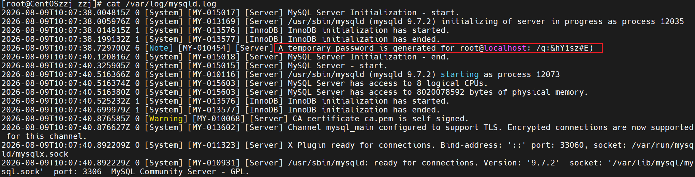

不好看，其实有更好看的方法

```shell
cat /var/log/mysqld.log | grep "password"
```

直接就显示账号密码了

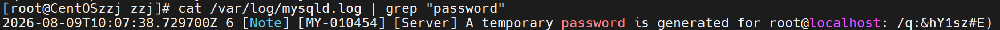

用户名：root

密码：/q:&hY1sz#E)

### 登录MySQL

```shell
mysql -uroot -p
Enter password:/q:&hY1sz#E)
```

可见，成功登录MySQL

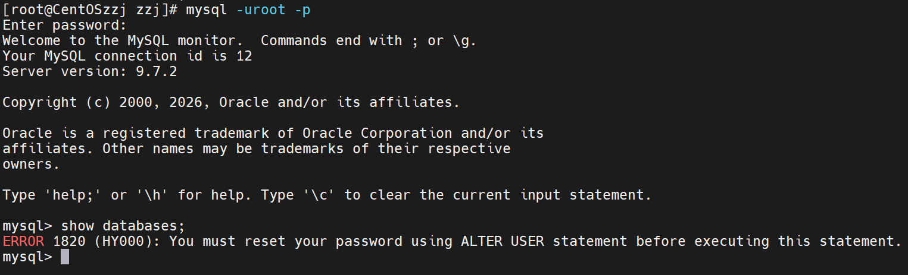

但是，尝试执行一个Mysql语句，提示没有设置新密码，无法进行任何操作

### 设置MySQL新密码

新密码需要在MySQL控制台设置

密码要求：

不少于8位，大小写字母数字组合带特殊符号

ALTER USER 'root'@'localhost' IDENTIFIED BY '密码'

```mysql
ALTER USER 'root'@'localhost' IDENTIFIED BY 'Zzj20050521@';
```

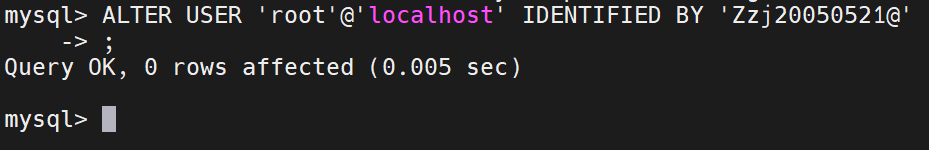

至此，密码设置成功，可以进行MySQL操作

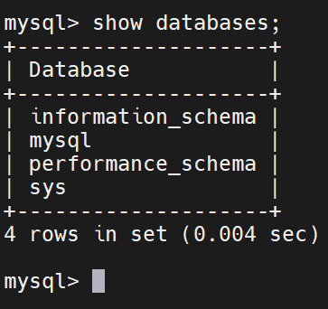

至此，MySQL的安装与配置已经全部完成，可以正常使用

## 拓展配置

### 配置简单密码

密码级别：低

密码最小长度：4

```mysql
SET GLOBAL validate_password.policy = LOW;
SET GLOBAL validate_password.length = 4;
```

然后就可以修改简单密码了

如“1234”

```mysql
ALTER USER 'root'@'localhost' IDENTIFIED BY '1234';
```

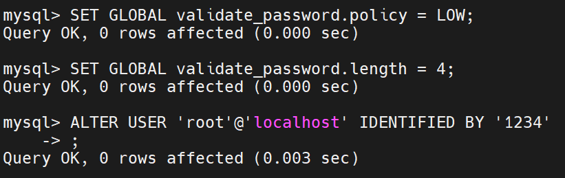

退出再次登录，登录成功

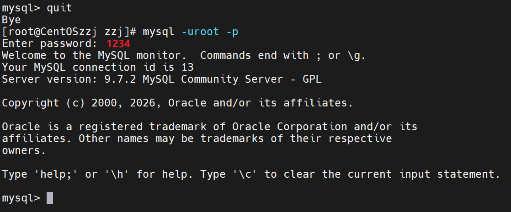

该配置需要写入配置文件"/etc/my.cnf"，否则重启后不再生效

#### 写入配置文件

```shell
vim /etc/my.cnf
```

写入配置：

```shell
validate_password.policy=LOW
validate_password.length=4
```

保存退出

### 配置远程登录

MySQL默认不允许远程登录

CREATE USER 'root'@'%' IDENTIFIED BY '密码';
GRANT ALL PRIVILEGES ON *.* TO 'root'@'ip地址' WITH GRANT OPTION;

ip地址处可以填“%”，表示所有ip都可以远程登录

创建远程用户root，密码1234

赋予所有权限

刷新权限

```mysql
CREATE USER 'root'@'%' IDENTIFIED BY '1234';
GRANT ALL PRIVILEGES ON *.* TO 'root'@'%' WITH GRANT OPTION;
FLUSH PRIVILEGES;
```

账号密码是独立的，远程登录的账号密码和本地登录的密码可以不一样

这是一个远程用户root，密码1234

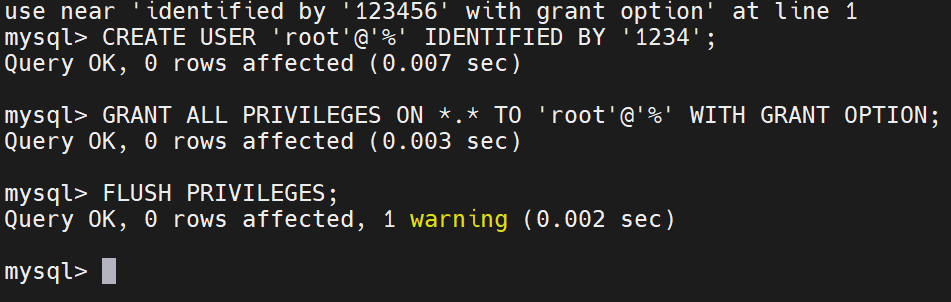

#### 验证

##### 查看3306端口

```shell
netstat -anp | grep "3306"
```

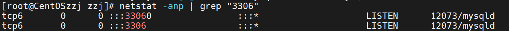

可见:::3306对应mysqld，表示所有ip可访问

##### 防火墙放行

```shell
firewall-cmd --list-ports
```

发现输出为空，说明防火墙并未放行3306端口

执行放行，重新加载

```shell
firewall-cmd --add-port=3306/tcp --permanent
firewall-cmd --reload
```

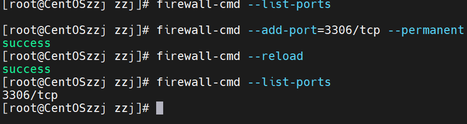

 查看远程用户

```mysql
SELECT user, host FROM mysql.user;
```


两个root，其中root的%就是远程的

##### windows连接

```shell
Test-NetConnection 192.168.253.135 -Port 3306
```

输入后等待一会儿。。。

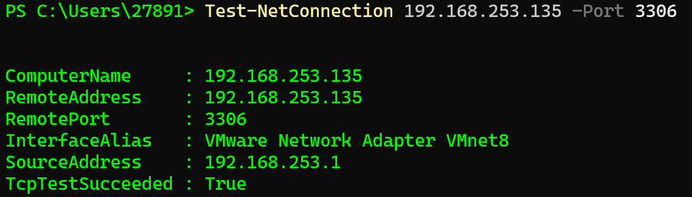

连接可行

冲！

```shell
mysql -h 192.168.253.135 -P 3306 -u root -p1234
```

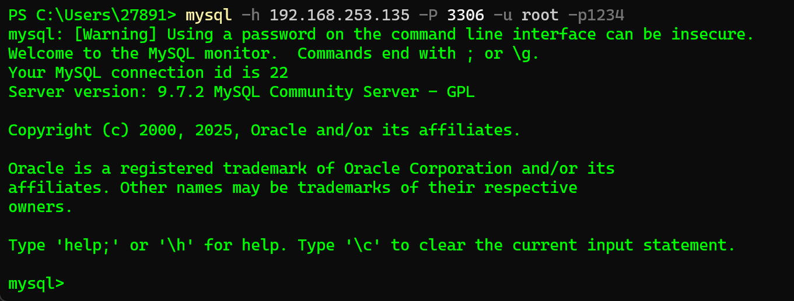

ok，搞定！
