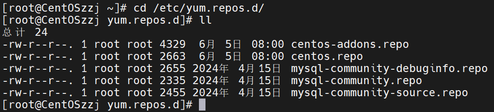
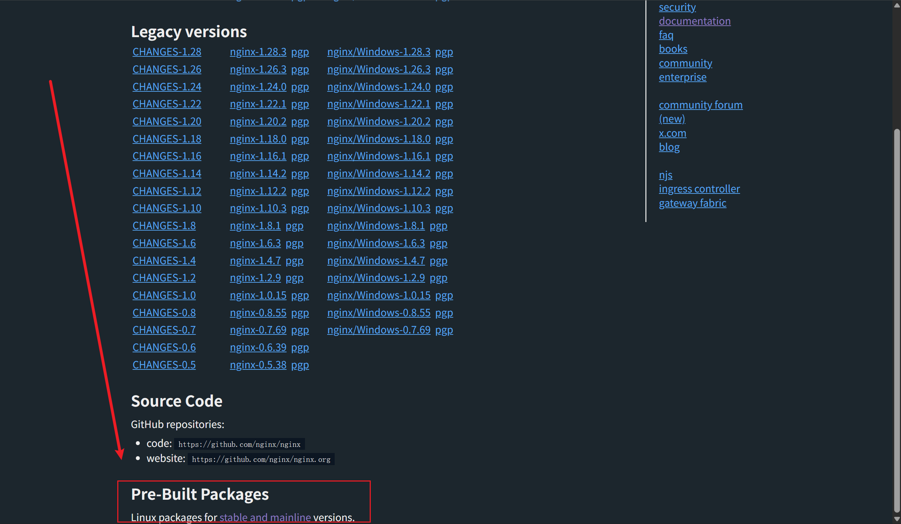
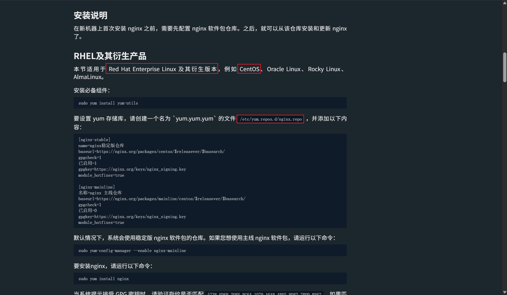
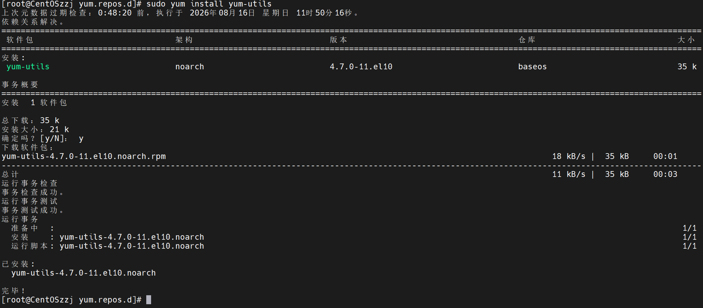
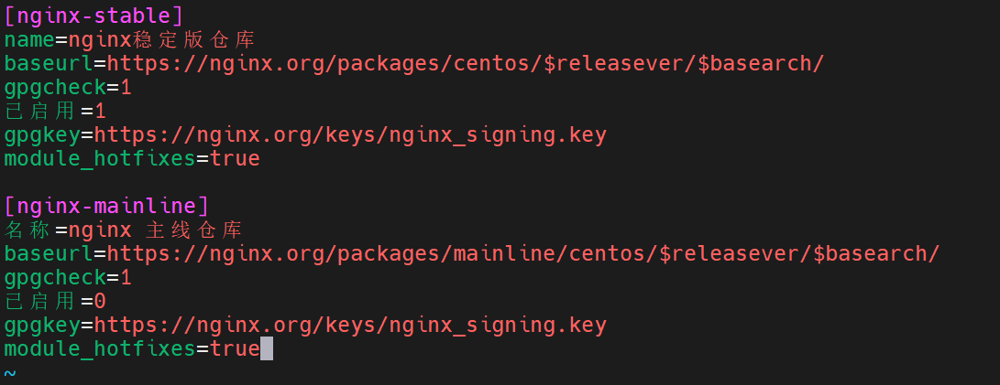
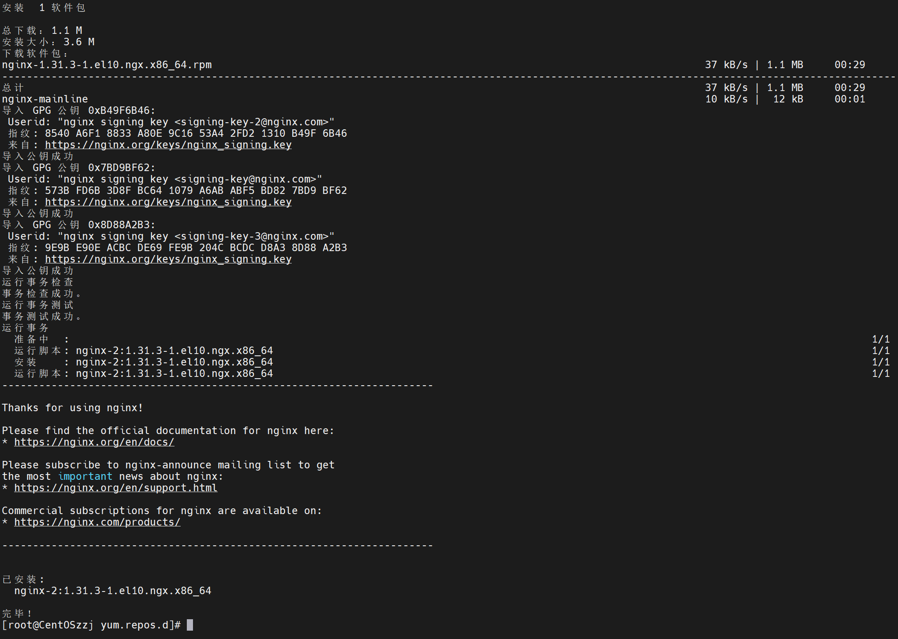
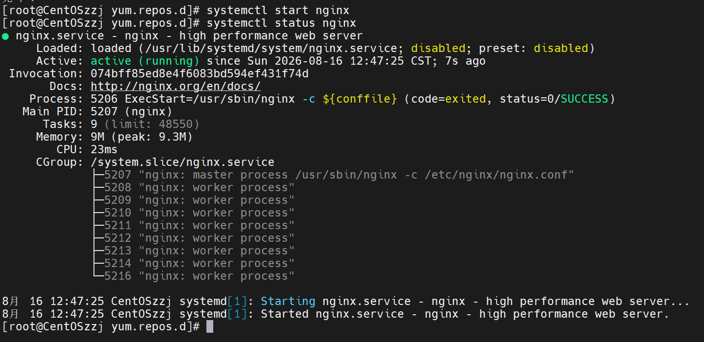
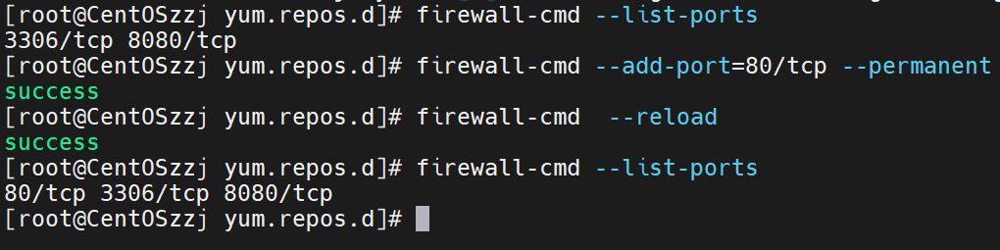
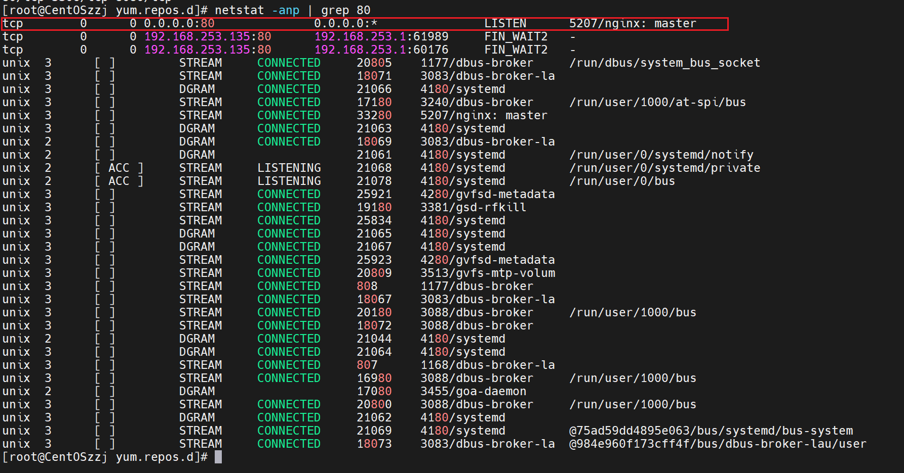
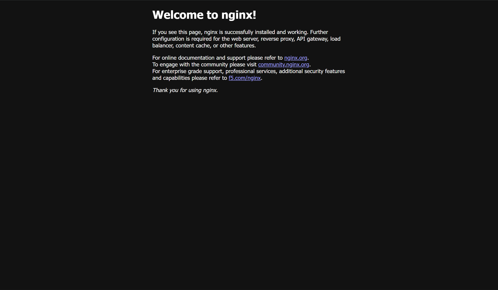

# Nginx

## 官方yum源安装

进入yum仓库查看

```shell
cd /etc/yum.repos.d/
```

## 查看仓库



里面还能看到我以前装的MySQL仓库

## 手动建Nginx仓库

这里先手动建一个Nginx仓库

```shell
vim nginx.repo
```

## 寻找仓库配置

然后配置去官网找

打开Nginx官网，点击“download”


里面是一些安装包，划到底



看不懂？翻译！


是预购建软件包，点进去



## 安装yum组件

原来还要安装个组件

```
sudo yum install yum-utils
```



安装完成

## 把配置写入仓库

```shell
vim /etc/yum.repos.d/nginx.repo
```



保存退出

## 开始安装

然后就可以之间安装了

```shell
yum install -y nginx
```



安装完成

启动服务

```
systemctl start nginx
```



启动成功

## 防火墙放行

防火墙放行一下80端口

```shell
firewall-cmd --add-port=80/tcp --permanent
firewall-cmd --reload
```



## 验证安装

查看端口

```
netstat -anp | grep 80
```



可见nginx进程监听80端口

打开浏览器输入CentOS主机ip，默认80端口



Welcome to nginx!