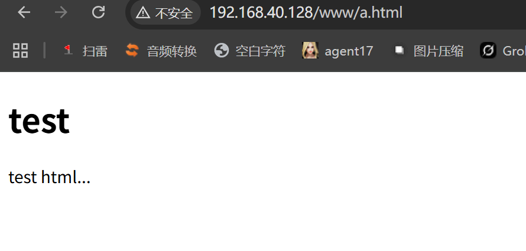
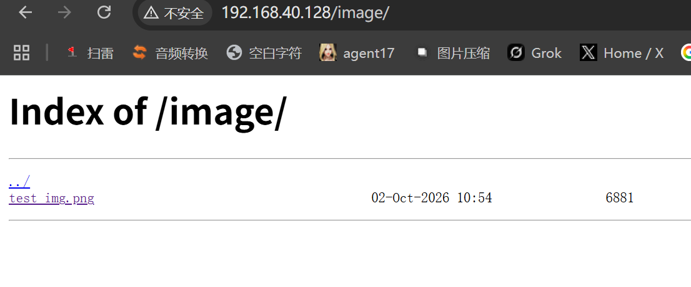
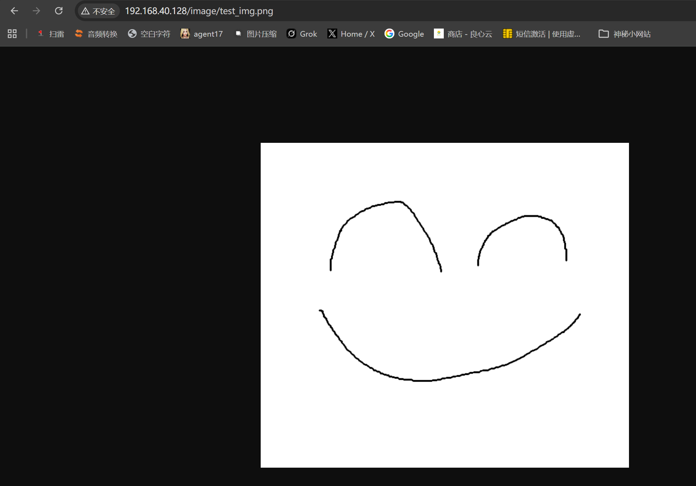

# Nginx动静分离

预期效果：分开访问动态和静态资源

访问http://192.168.40.128/image/可以访问图片

访问http://192.168.40.128/www/a.html可以访问静态网页

准备素材：

/data/www/a.html

```html
<!DOCTYPE html>
<html lang="zh-CN">
<head>
    <meta charset="UTF-8">
    <title>test</title>
</head>
<body>
    <h1>test</h1>
    <p>test html...</p>
</body>
</html>
```

/data/image/test_ing.png


## Nginx配置

然后开始写nginx配置

```
vim /etc/nginx/conf.d/default.conf
```

server主要配置如下：

```nginx
server {
    listen       80;
    server_name  192.168.40.128;

    location /www {
        root   /data/;
        index  index.html index.htm;
    }

    location /image {
        root   /data/;
        autoindex on;
    }
}
```

重载nginx

```shell
nginx -t && systemctl reload nginx
```

浏览器访问：

http://192.168.40.128/image

http://192.168.40.128/www/a.html

发现撞上了SELinux报403

## 设置SELinux放行

```shell
semanage fcontext -a -t httpd_sys_content_t '/data(/.*)?'
restorecon -RFv /data
```

再次访问：





