# Nginx反向代理

## 实例一：

需要达到的效果：

在外部客户端浏览器访问一个域名，由nginx反向代理到tomcat页面

### 启动Tomcat

目前已安装tomcat11.0.24，上次装过了，位于/export/server/apache-tomcat-11.0.24

创了个链接文件在root目录里

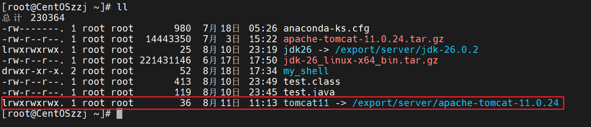

进入目录运行tomcat

```shell
cd tomcat11/bin
./startup.sh
```

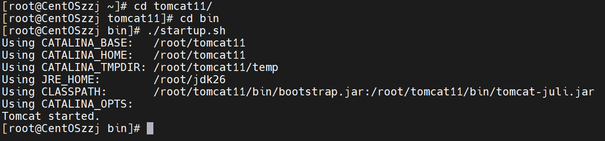

 现在可以直接访问192.168.253.135:8080看见tomcat页面了

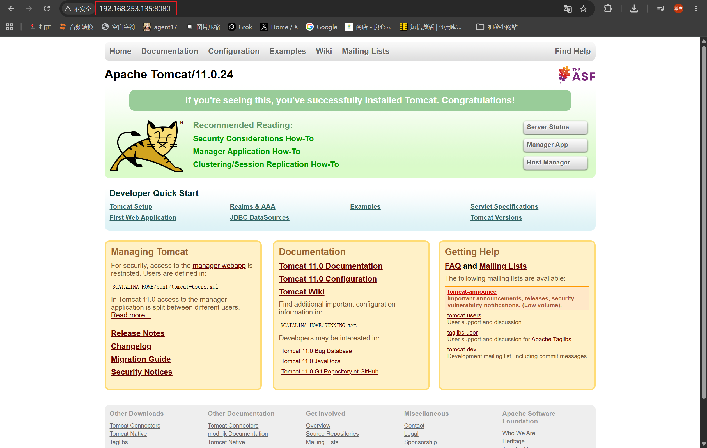

tomcat就启动完毕

由于申请不了公共的域名，所以就在自己电脑里的dns的host加一条本地域名吧

域名就用www.zzj.com

### 添加host本地域名

打开C:\Windows\System32\drivers\etc\hosts

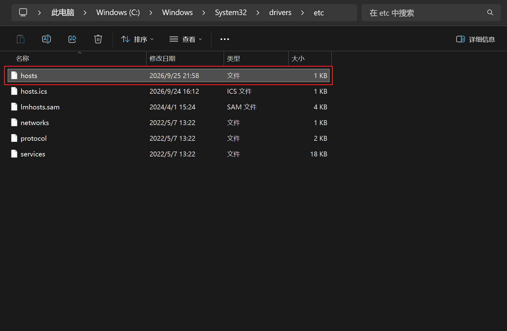

打开后在底下加一条

```shell
192.168.253.135 www.zzj.com
```

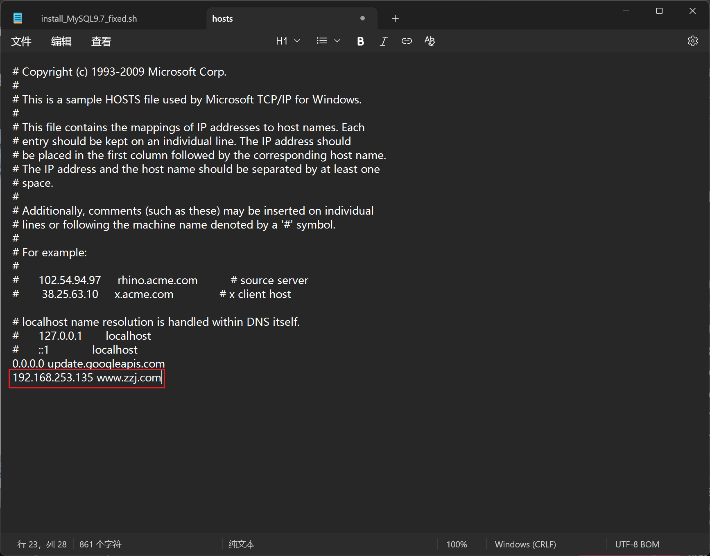

设置完这个后，现在可以通过www.zzj.com:8080进行tomcat访问

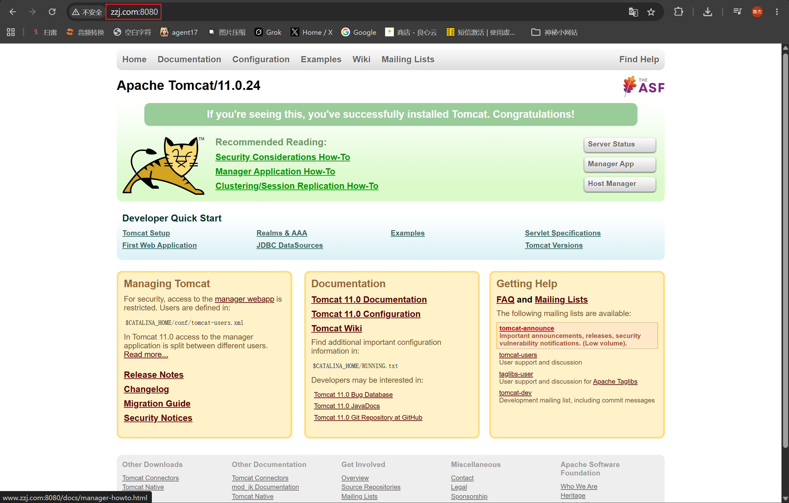

但还没有达到最终效果

我们需要只访问www.zzj.com，不要端口号

现在来设置nginx反向代理

### Nginx配置反向代理

打开nginx的配置文件nginx.conf

```shell
vim /etc/nginx/nginx.conf
```

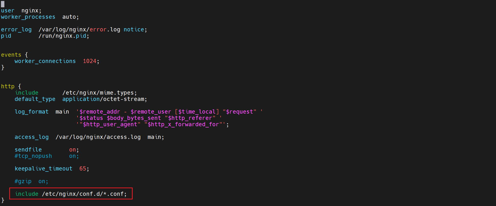

打开发现server模块不见了

注意到底部写着`include /etc/nginx/conf.d/*.conf`

查看`/etc/nginx/conf.d`目录

```shell
ls /etc/nginx/conf.d
```

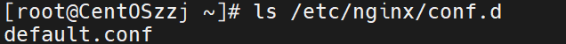

发现里面有个`default.conf`

打开看看

```shell
vim /etc/nginx/conf.d/default.conf
```

原来server在这里

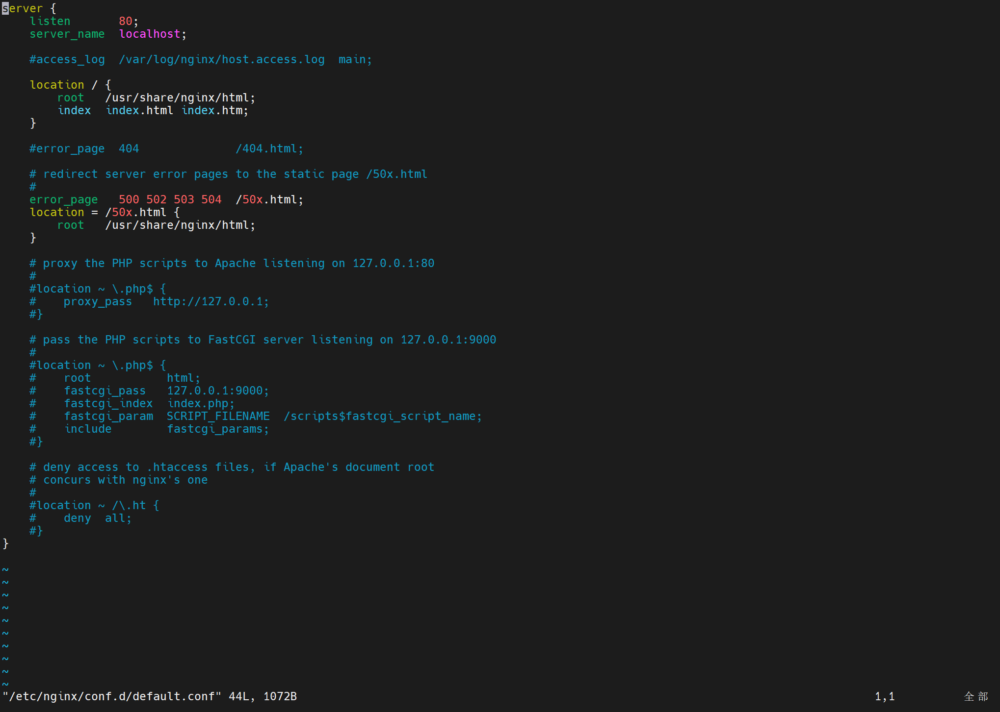

现在修改配置文件

#### 修改配置文件

主机改为 www.zzj.com 192.168.253.135

再在location里加一条

proxy_pass 指定为http://127.0.0.1:8080;

没用的root和index删掉


#### 重载nginx

```shell
systemctl restart nginx
```

#### 修改selinux

改一下selinux才可以访问（类似于防火墙）

```shell
setsebool -P httpd_can_network_connect on
```

#### 验证

浏览器访问www.zzj.com

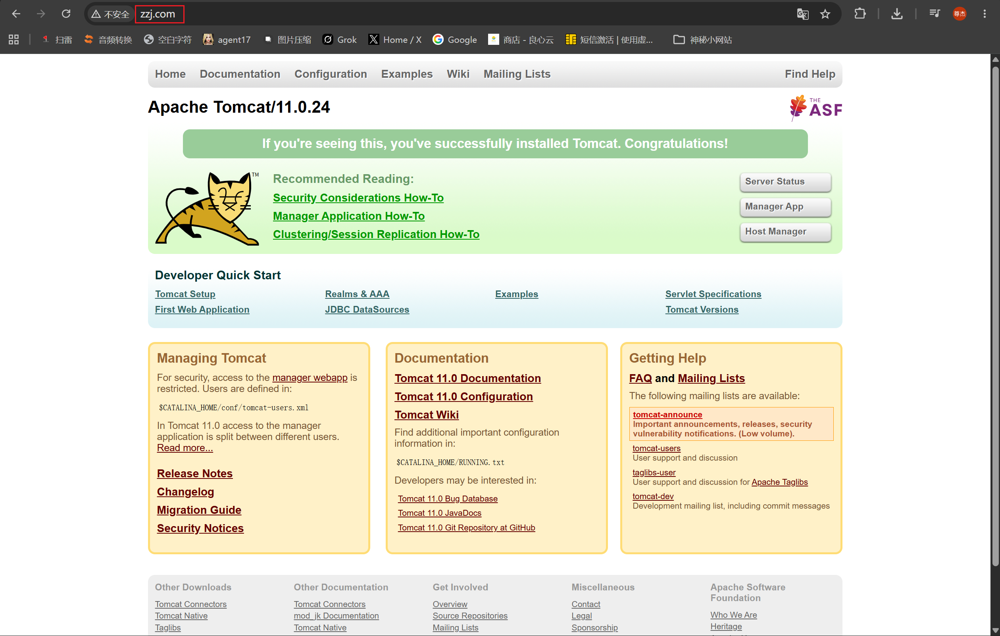

## 实例二

需要达到的效果：

访问两个不同的路径，跳转到不同的端口

如：

访问：http://192.168.253.135:9001/test1/	跳转到127.0.0.1:8080

访问：http://192.168.253.135:9001/test2/	跳转到127.0.0.1:8081

### 启动两个Tomcat

先建两个文件夹：tomcat8080、tomcat8081

```shell
cd /export/server
mkdir tomcat8080 tomcat8081
```

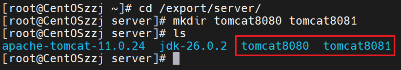

回到tomcat压缩包所在处，分别将其解压到两个文件夹中

```shell
cd ~
tar zxvf apache-tomcat-11.0.24.tar.gz -C /export/server/tomcat8080
tar zxvf apache-tomcat-11.0.24.tar.gz -C /export/server/tomcat8081
```

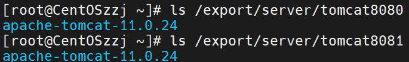

启动两个tomcat不能都使用8080，要将其中一个端口改为8081

```shell
vim /export/server/tomcat8081/apache-tomcat-11.0.24/conf/server.xml
```

把用到的端口都改一改

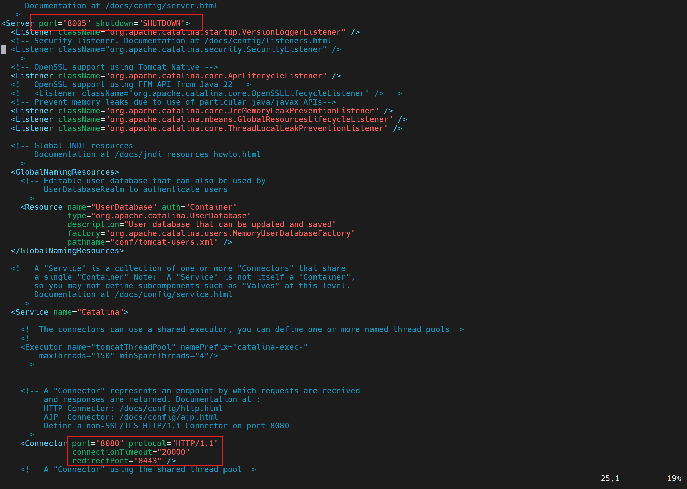

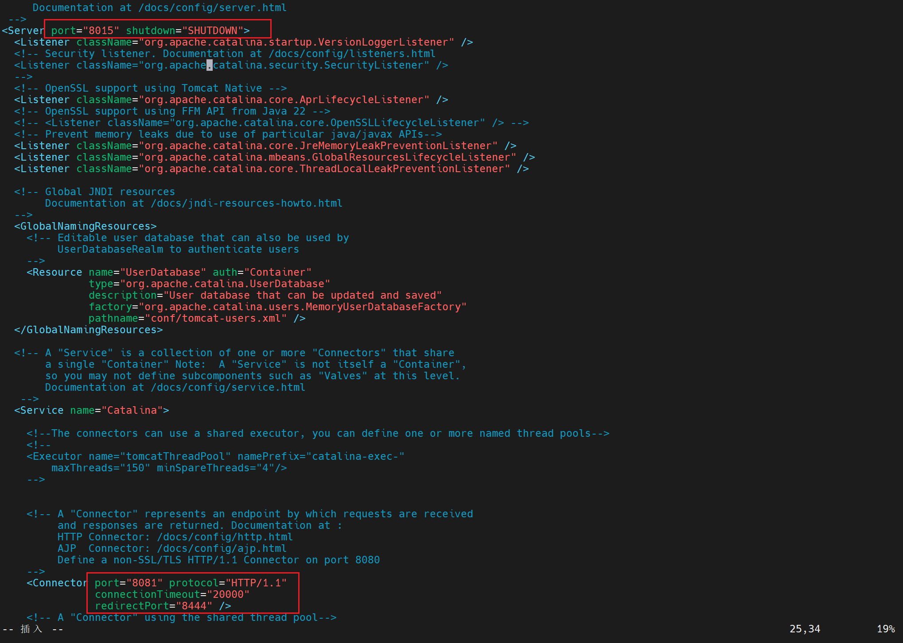

shutdown端口改为8015

协议端口改为8081，重定向端口改为8444

然后启动两个tomcat

```shell
sh /export/server/tomcat8080/apache-tomcat-11.0.24/bin/startup.sh
sh /export/server/tomcat8081/apache-tomcat-11.0.24/bin/startup.sh
```

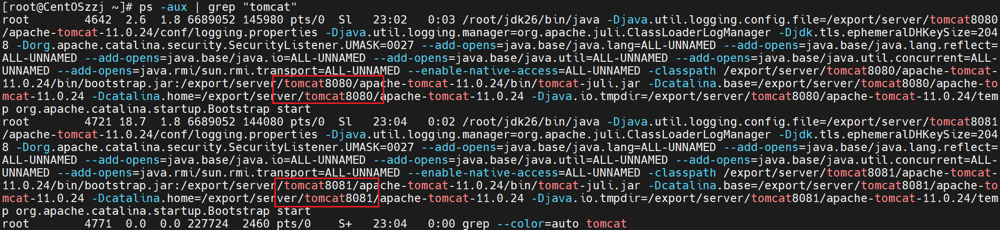

可见两个tomcat进程没有冲突

浏览器访问发现192.168.253.135:8080可以访问，但192.168.253.135:8081无法访问

看看防火墙

```shell
firewall-cmd --list-all
```

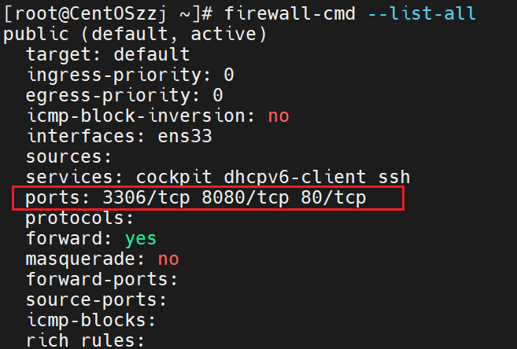

原来是没放行8081端口

```shell
firewall-cmd --add-port=8081/tcp --permanent
firewall-cmd --reload
```

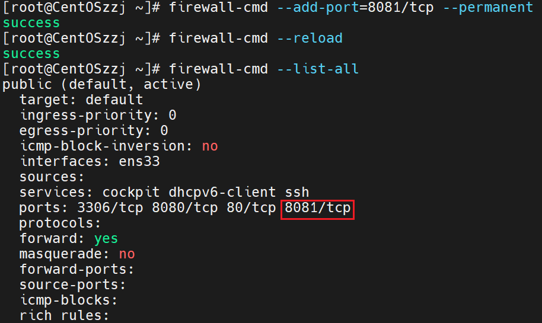

现在两个都能访问了

### 放置测试页面

现在放两个测试的html网页文件用于区分

先分别在两个tomcat的webapps下建两个文件夹

```shell
mkdir /export/server/tomcat8080/apache-tomcat-11.0.24/webapps/test1/
mkdir /export/server/tomcat8081/apache-tomcat-11.0.24/webapps/test2/
```

然后写两个html文件放进去

```shell
vim /export/server/tomcat8080/apache-tomcat-11.0.24/webapps/test1/tes1.html
vim /export/server/tomcat8081/apache-tomcat-11.0.24/webapps/test2/tes2.html
```

随便写点东西

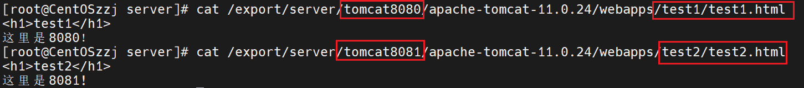

浏览器分别访问：

http://192.168.253.135:8080/test1/test1.html

http://192.168.253.135:8081/test2/test2.html

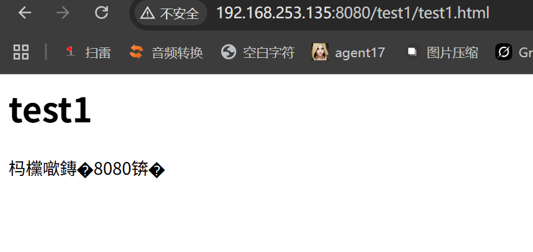

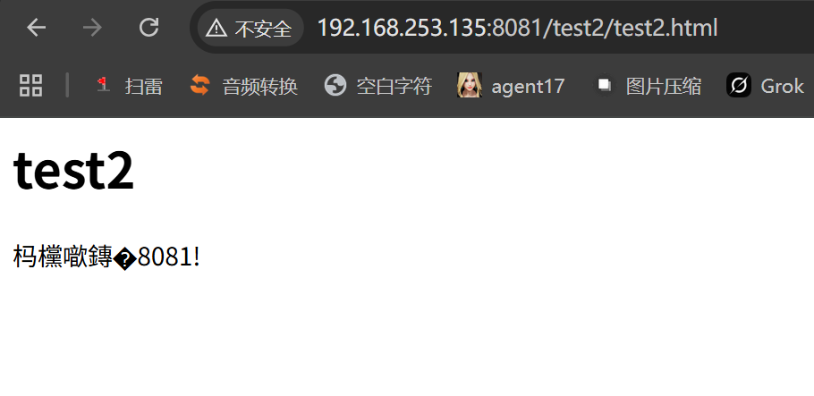

中文好像有点乱码，问题不大

### Nginx配置反向代理

还是写server配置

```shell
vim /etc/nginx/conf.d/default.conf
```

在底下加一块server配置

监听端口改为9001

主机名还是192.168.253.135

然后两个路径跳转两个端口

```nginx
server {
        listen 9001;
        server_name 192.168.253.135;

        location ~ /test1/ {
                proxy_pass http://127.0.0.1:8080;
        }

        location ~ /test2/ {
                proxy_pass http://127.0.0.1:8081;
        }
}

```

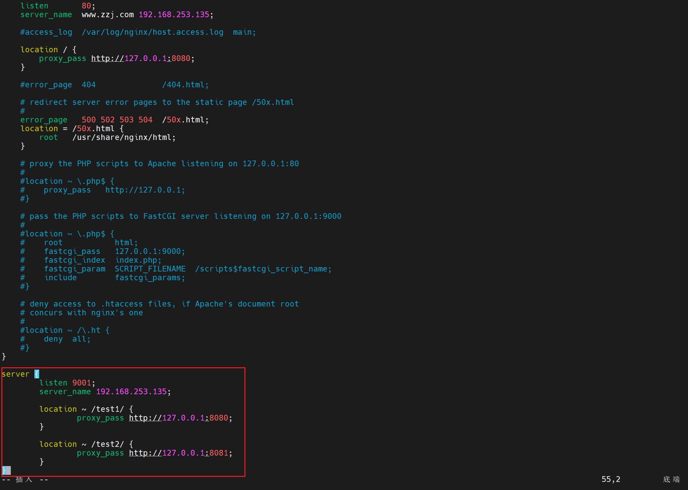

别忘了放行9001端口

```shell
firewall-cmd --add-port=9001/tcp --permanent
firewall-cmd --reload
```

重载nginx

```shell
systemctl restart nginx
```

#### nginx起不来——selinux不让绑定9001

重载之后发现nginx没起来

```shell
systemctl status nginx
```

看日志找原因

```shell
journalctl -u nginx -n 20
```

报错是

```
nginx: [emerg] bind() to 0.0.0.0:9001 failed (13: Permission denied)
```

意思是selinux不允许nginx绑定9001端口

⚠️ 记住这个判据：看到 `Permission denied`（errno 13）时，先看是哪个系统调用，不同的调用对应不同的层和不同的修法

| 报错 | 意思 | 怎么修 |
|---|---|---|
| `bind() ... Permission denied` | nginx不能绑这个端口 | `semanage port`（就是本节） |
| `connect() ... Permission denied` | nginx不能连后端 | `setsebool -P httpd_can_network_connect on` |
| `open() ... Permission denied` | nginx不能读写这个文件 | `restorecon -v 文件名` |

（对比：防火墙拦是 `Connection refused` 或 `Timed out`，不是 `Permission denied`）

查一下9001属于哪个端口类型

```shell
semanage port -l | grep 9001
```

```
tor_port_t    tcp    6969, 9001, 9030, 9050, 9051, 9150
```

原来9001属于`tor_port_t`（Tor代理用的端口类型），而nginx只能绑定`http_port_t`类型的端口

看看白名单里都有哪些

```shell
semanage port -l | grep '^http_port_t'
```

```
http_port_t    tcp    80, 81, 443, 488, 8008, 8009, 8443, 9000
```

9001不在里面，所以被拒了

把9001加进白名单

```shell
semanage port -m -t http_port_t -p tcp 9001
```

⚠️ 这里要用`-m`（modify），不能用`-a`（add）——9001已经被`tor_port_t`占用了，用`-a`会报`Port tcp/9001 already defined`

判断该用哪个的规则：

```shell
semanage port -l | grep -w 9001
```

- 有输出 → 端口已经被某个类型占用 → 用`-m`
- 无输出 → 端口无主 → 用`-a`

拿不准就先敲`-a`，报`already defined`再换`-m`

验证一下

```shell
semanage port -l -C
```

9001已经在`http_port_t`下了

再启动nginx

```shell
systemctl start nginx
```

这次起来了

> 💡 想省事的话：直接用 `9000` 端口（本来就在白名单里），这一节整节都不需要

### 验证

去浏览器访问验证

访问http://192.168.253.135:9001/test1/test1.html

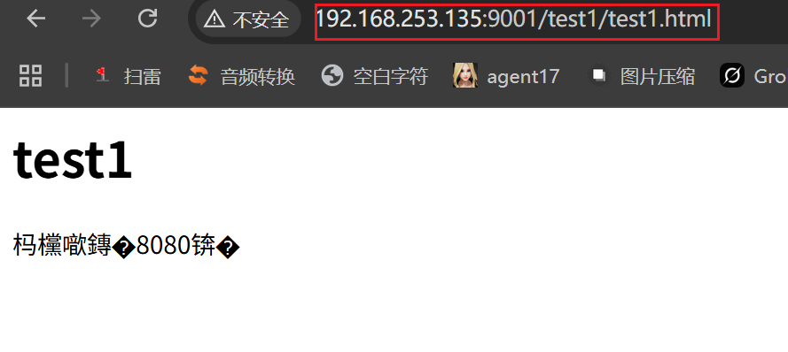

访问http://192.168.253.135:9001/test2/test2.html

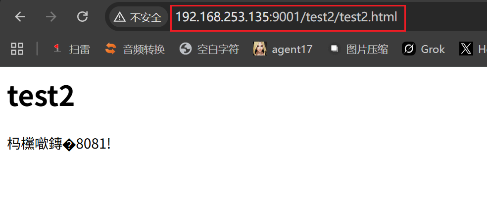

## 额外配置

现在修一下乱码

其实只需要在html里声明一下utf-8编码就行

```html
<!DOCTYPE html>
<html lang="zh-CN">
<head>
    <meta charset="UTF-8">
    <title>test1</title>
</head>
<body>
    <h1>test1</h1>
    <p>这里是 8080 端口！</p>
</body>
</html>
```

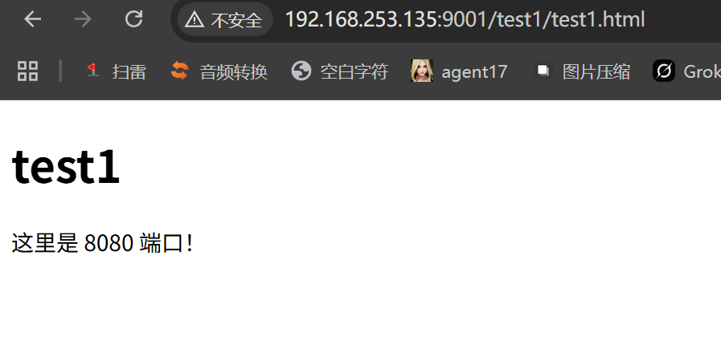