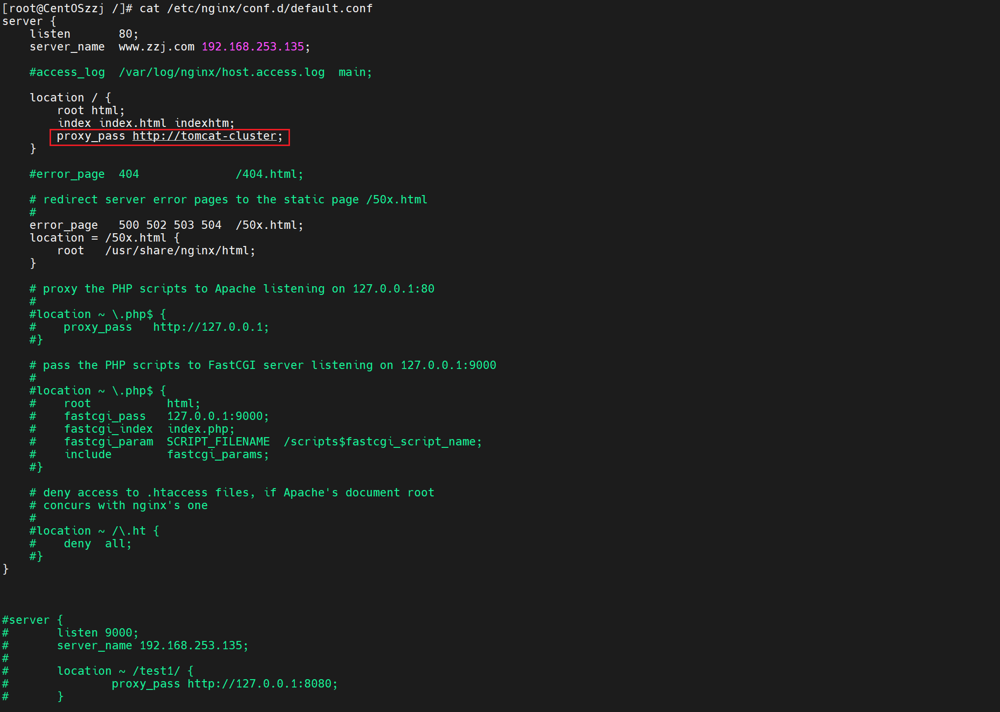
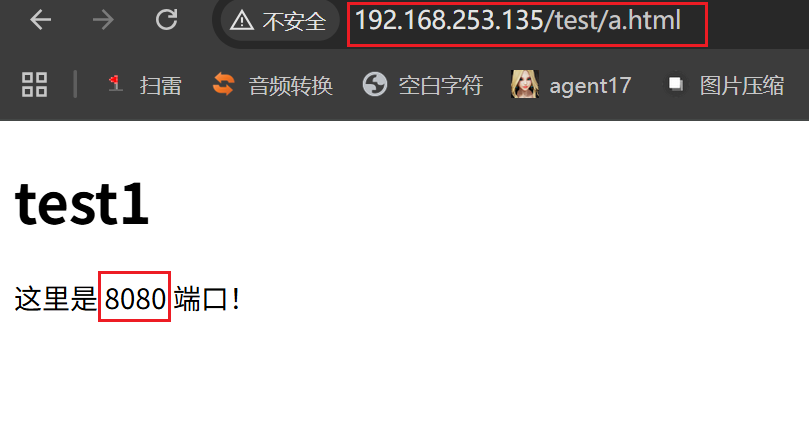
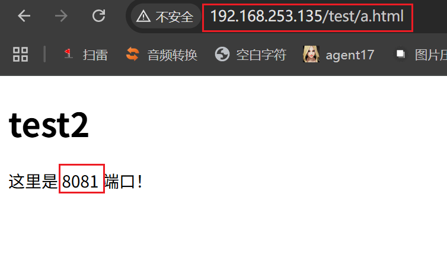

# Nginx负载均衡

需要达到的效果：

将访问192.168.253.135/test/a.html的请求平均分配到8080、8081端口

同一个文件分布在两台服务器中，将访问请求分流

## 准备文件

分别准备以下文件

/export/server/tomcat8080/apache-tomcat-11.0.24/webapps/test/a.html

/export/server/tomcat8081/apache-tomcat-11.0.24/webapps/test/a.html

注意绝对路径`/webapps/test/a.html`要相同


## 配置负载均衡

分别在`/etc/nginx/nginx.conf`的http里写上：

```nginx
upstream tomcat-cluster{
            server 192.168.253.135:8080;
            server 192.168.253.135:8081;
    }

```

`tomcat-cluster`为自定义的名称

再往`/etc/nginx/conf.d/default.conf`把proxy_pass地址改为`http://tomcat-cluster;`



### 重载nginx

```shell
nginx -t && systemctl reload nginx
```

访问：192.168.253.135/test/a.html

### 验证

刷新网页可见，访问的请求在8080和8081来回跳动



