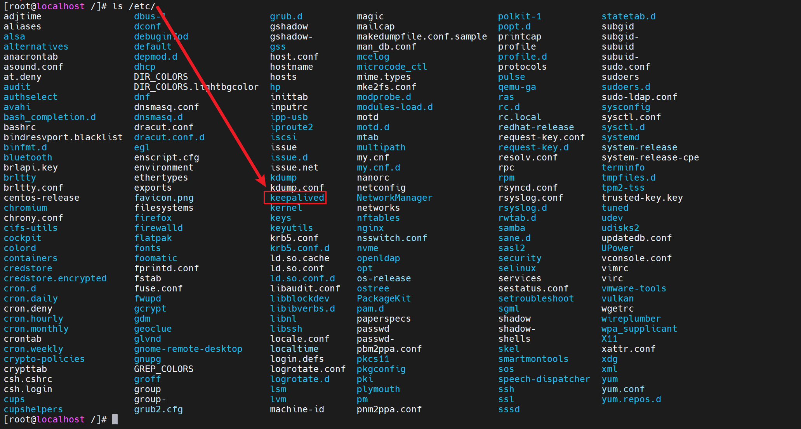
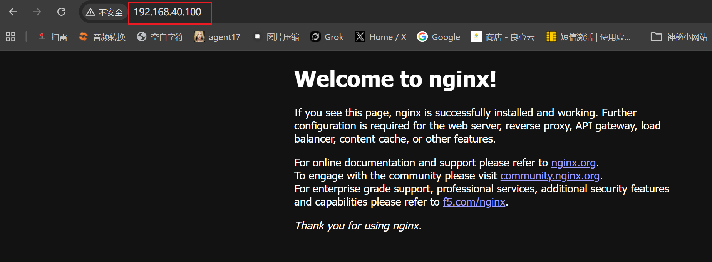
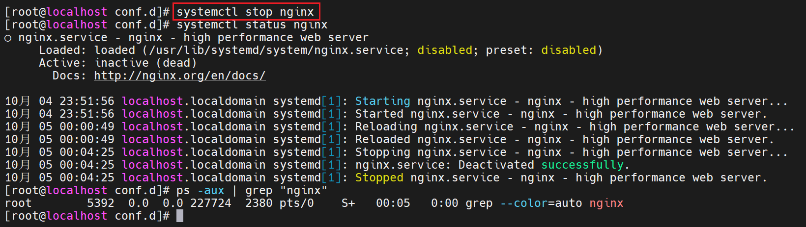
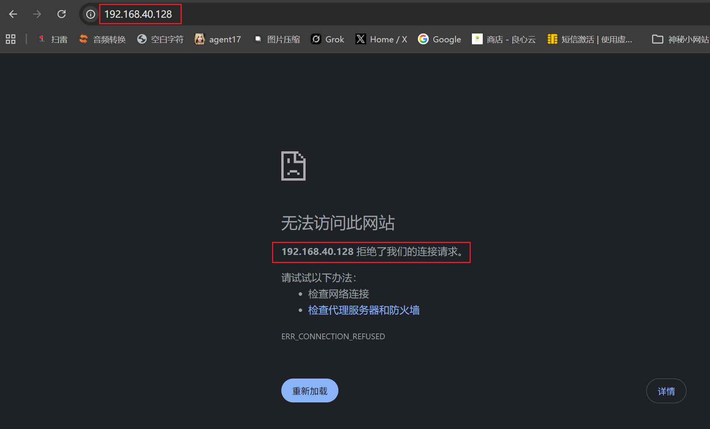

# Nginx高可用

## 准备工作

先准备两台服务器

192.168.40.128	192.168.40.130

### 安装Nginx

全部安装nginx

以下提供安装脚本：Nginx_install.sh

```shell
#!/bin/bash
echo "开始安装Nginx"
echo "安装yum-utils组件"
yum -y install yum-utils
echo "写入repo仓库配置"
cat > /etc/yum.repos.d/nginx.repo << 'EOF'
[nginx-stable]
name=nginx stable repo
baseurl=https://nginx.org/packages/centos/$releasever/$basearch/
gpgcheck=1
enabled=1
gpgkey=https://nginx.org/keys/nginx_signing.key
module_hotfixes=true

[nginx-mainline]
name=nginx mainline repo
baseurl=https://nginx.org/packages/mainline/centos/$releasever/$basearch/
gpgcheck=1
enabled=0
gpgkey=https://nginx.org/keys/nginx_signing.key
module_hotfixes=true
EOF
echo "开始安装Nginx"
yum install -y nginx
systemctl start nginx
firewall-cmd --add-port=80/tcp --permanent
firewall-cmd --reload
```

执行脚本

```shell
bash Nginx_install.sh
```

### 安装keepalived

在两台服务器中安装keepalived

```shell
yum install keepalived -y
```

keepalived安装在etc目录下



## 配置vrrp高可用

### 配置keepalived.conf

修改keepalived.conf配置文件

```shell
vim /etc/keepalived/keepalived.conf
```

写入以下内容：

```shell
global_defs {
	notification_email {
		acassen@firewall.loc
		failover@firewall.loc
		sysadmin@firewall.loc
	}
	notification_email_from Alexandre.Cassen@firewall.loc
	smtp_server [ip地址]
	smtp_connect_timeout 30
	router_id LVS_DEVELBACK
}

#检测脚本
vrrp_script chk_http_port {
	script "/usr/local/src/nginx_check.sh"	#此处为检测脚本地址
	interval 2 #检测间隔
	weight 2
}

vrrp_instance VI_1 {
	state [身份]	#此处为服务器身份，主MASTER，从BACKUP
	interface ens160	#网卡名称
	virtual_router_id 51	#虚拟路由id，主从一致
	priority 100	#优先级,越大越优先
	advert_int 1
	authentication {
		auth_type PASS
		auth_pass 1111
	}
	virtual_ipaddress {
		192.168.40.100	#虚拟地址
	}
	track_script {
		chk_http_port
	}
}
```

### 编写检测脚本

```shell
vim /usr/local/src/nginx_check.sh
```

写入以下内容：

```shell
#!/bin/bash
A=`ps -C nginx --no-header | wc -l`
if [ $A -eq 0 ];then
    /usr/sbin/nginx
    sleep 2
    if [ `ps -C nginx --no-header | wc -l` -eq 0 ];then
        killall keepalived
    fi
fi
```

给脚本执行权限

```shell
chmod +x /usr/local/src/nginx_check.sh
```

然后开启nginx和keepalived

```shell
systemctl start nginx
systemctl start keepalived.service
```

### 防火墙放行vrrp协议

```shell
firewall-cmd --permanent --add-protocol=vrrp
firewall-cmd --reload
```

## 验证

登陆虚拟ip：192.168.40.100



关掉一台

```shell
systemctl stop nginx
systemctl stop keepalived.service
```





192.168.40.128已不可访问

再访问192.168.40.100


还是可以访问

