# Tomcat

开root账户

## 查找版本

打开Tomcat官网

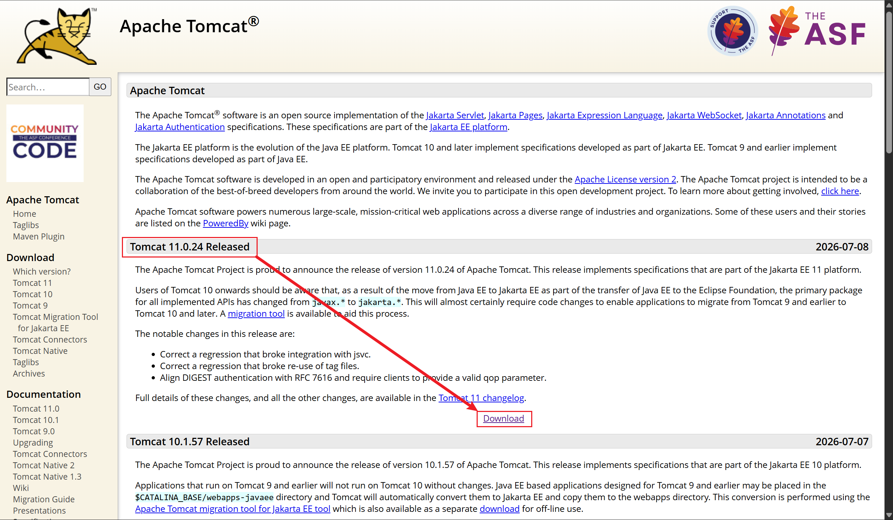

可见，现在已经到Tomcat11.0.24版本了

直接冲最新版

点击下载后，查看版本对应表

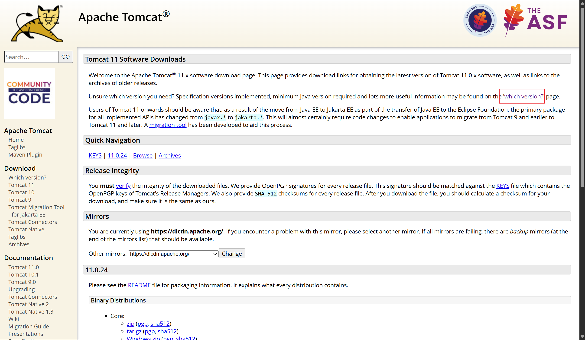

可见，Tomcat11.0 版本只支持JAVA17以后的版本

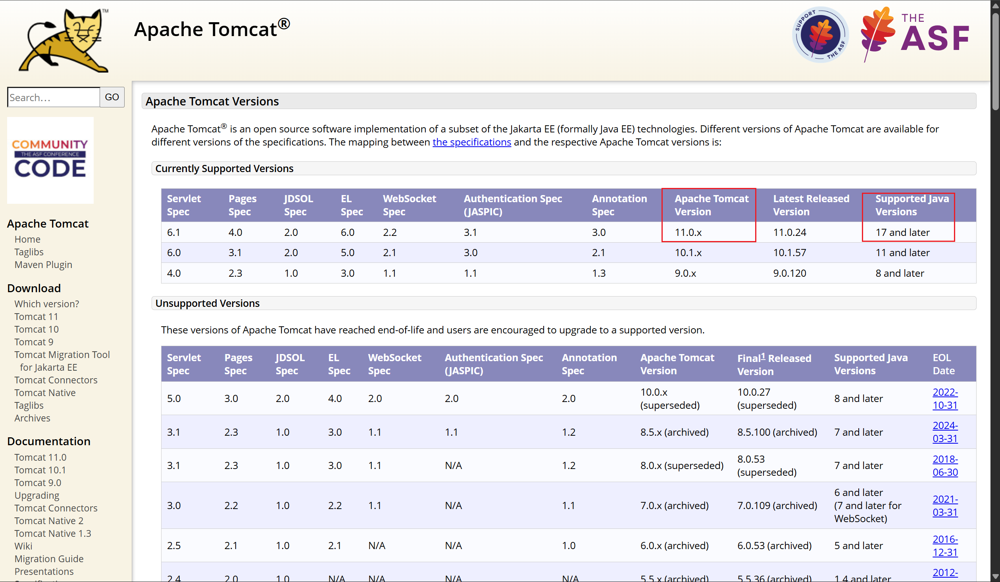

安装Tomcat之前需要先安装JDK

## JDK安装

### 下载JDK

浏览器搜索“JDK”

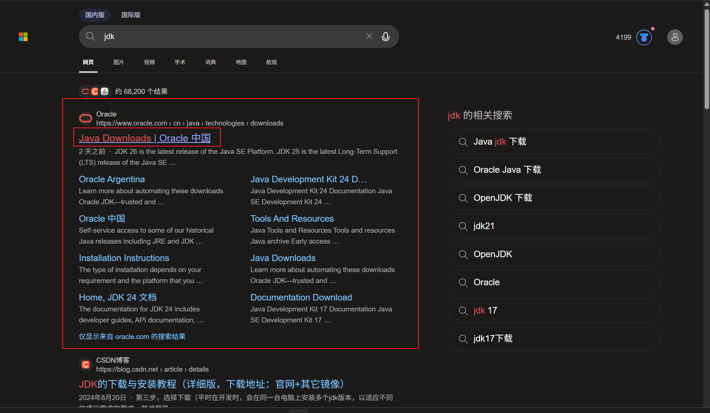

打开Oracle的JDK下载页面

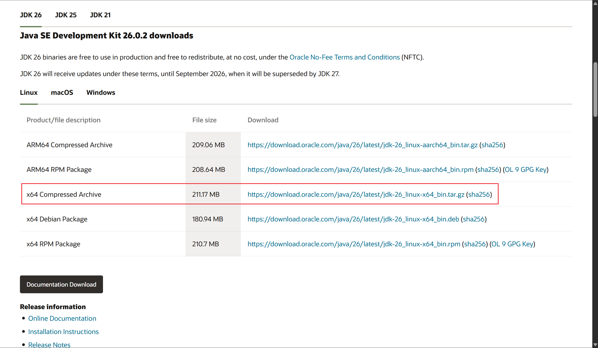

直接冲JAVA26

进CentOS开始下载

```shell
wget https://download.oracle.com/java/26/latest/jdk-26_linux-x64_bin.tar.gz
```

JDK两百多兆，等待片刻。。。

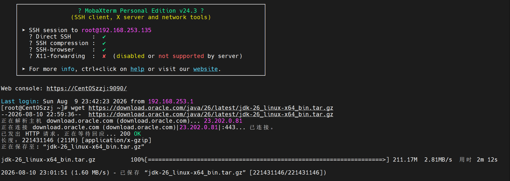

查看路径

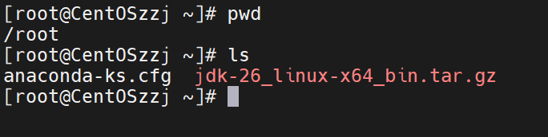

### 解压JDK包

这里看见，给下到root文件夹了，问题不大，j建个文件夹开始解压

```shell
mkdir -p /export/server
tar zxvf jdk-26_linux-x64_bin.tar.gz -C /export/server/
```

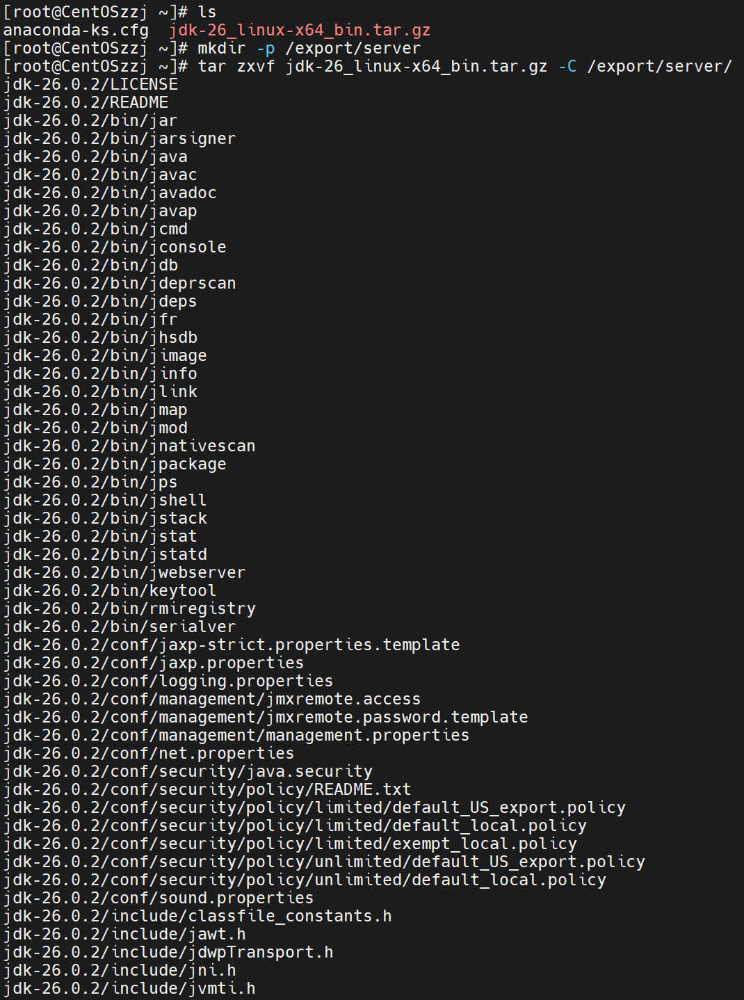

进到解压的目录

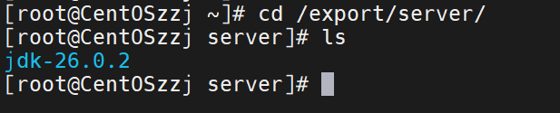

发现了jdk-26.0.2

创个软连接，也就是快捷方式，方便使用

```shell
ln -s /export/server/jdk-26.0.2 /root/jdk26
```


然后可以看到里面的内容，已经有java了

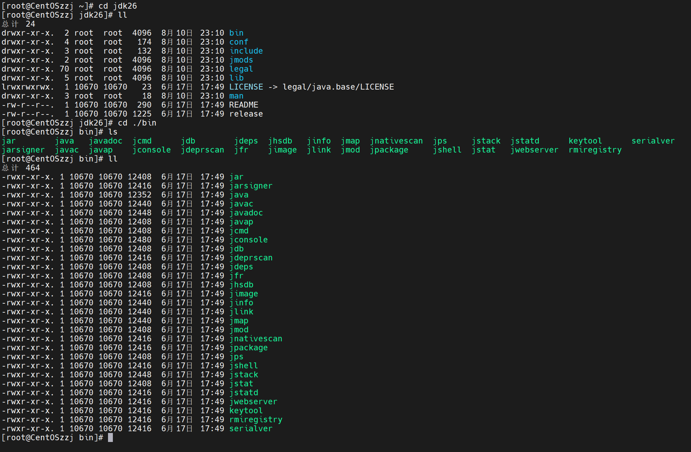

JDK就安装完成

### 配置JAVA环境变量

写一个全局的环境变量

```shell
vim /etc/profile
```

在底下写入以下内容

```shell
export JAVA_HOME=/root/jdk26
export PATH=$PATH:/$JAVA_HOME/bin
```


#### 一个隐形的坑

```
此处路径为了方便写在root目录，其他非root用户会读不到，所以无法使用java
日后请自行修改
vim /etc/profile
export JAVA_HOME=/export/server/jdk-26.0.2
export PATH=$PATH:/$JAVA_HOME/bin
```

保存退出后执行

```
source /etc/profile
```

使其生效

### 验证安装

先看看版本

```shell
java -version
```


然后传一个test.java试试运行

```shell
javac test.java
java test
```

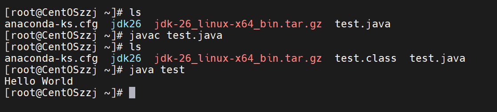

可见，编译运行成功

## 安装Tomcat

### 下载Tomcat

回到Tomcat下载页面，在下面复制下载链接

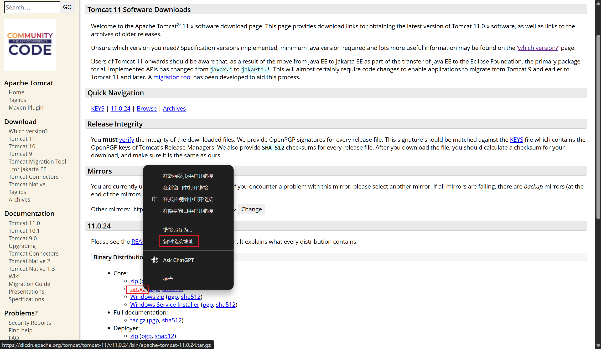

去到CentOS下载

```shell
wget https://dlcdn.apache.org/tomcat/tomcat-11/v11.0.24/bin/apache-tomcat-11.0.24.tar.gz
```

可见已经下载完毕

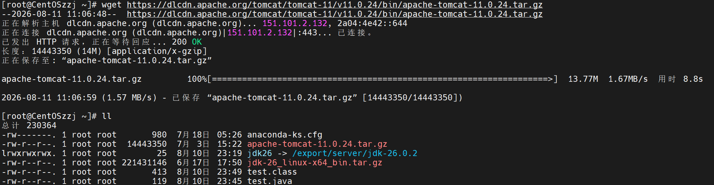

### 解压Tomcat

开始解压

```shell
tar zxvf apache-tomcat-11.0.24.tar.gz -C /export/server/
```

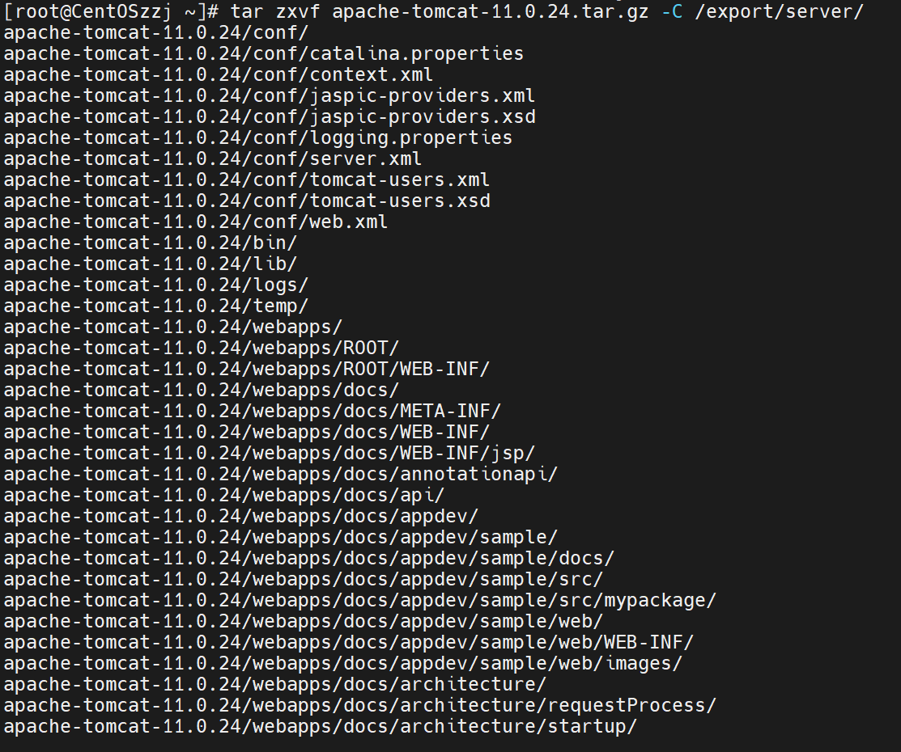

查看解压并创建软连接

```shell
cd /export/server
ln -s /export/server/apache-tomcat-11.0.24 /root/tomcat11
```

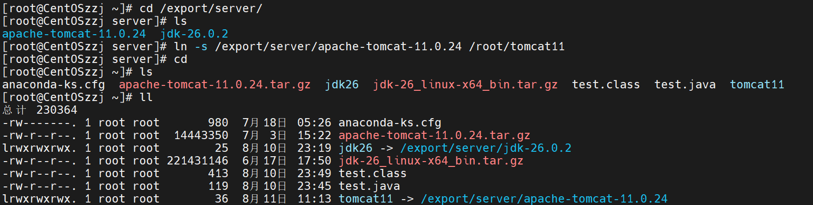

进入Tomcat

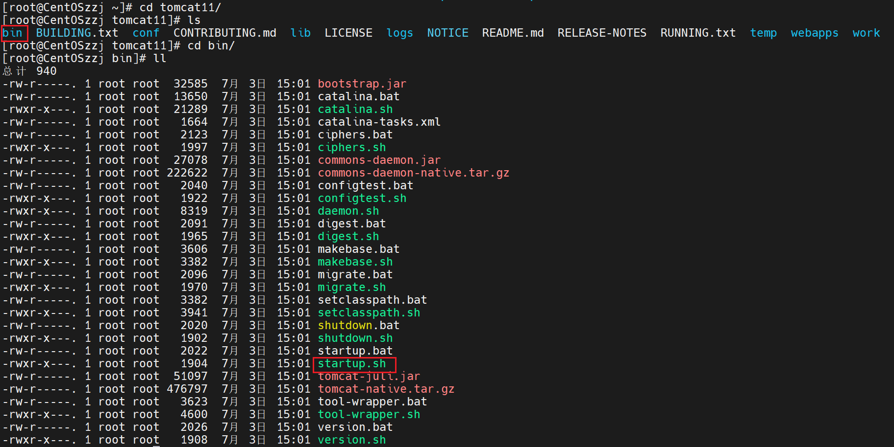

### 运行Tomcat

执行startup.sh

```shell
./startup.sh
```


启动成功

### 检查端口

检查一下8080端口

```shell
 netstat -anp|grep 8080
```

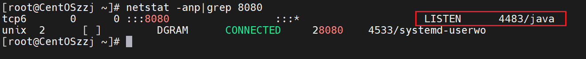

可见，已经被一个java进程监听

### 验证Tomcat

打开浏览器访问

CentOS的ip : 8080

```
192.168.253.135:8080
```

发现访问不了

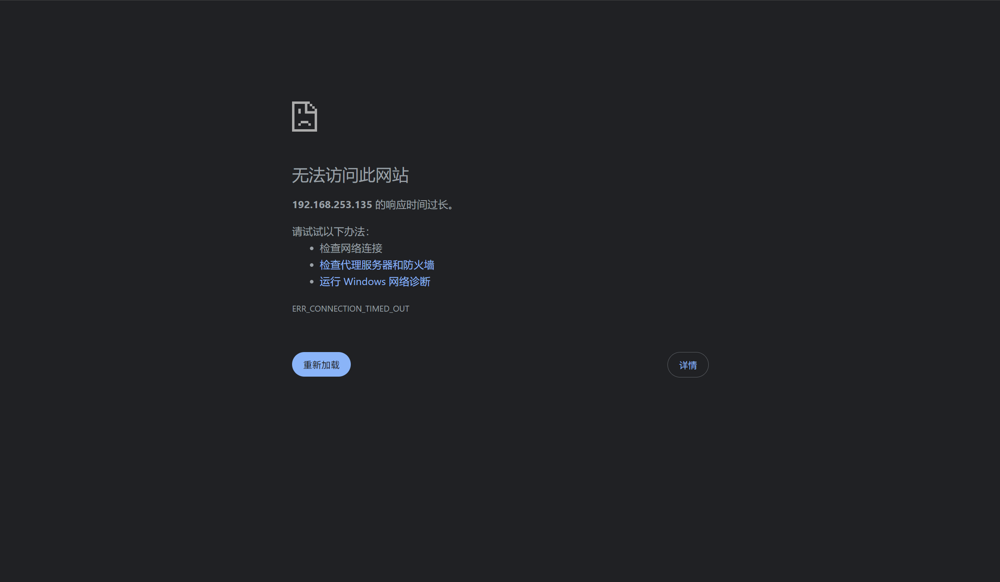

去到CentOS内访问

```shell
curl 127.0.0.1:8080
```

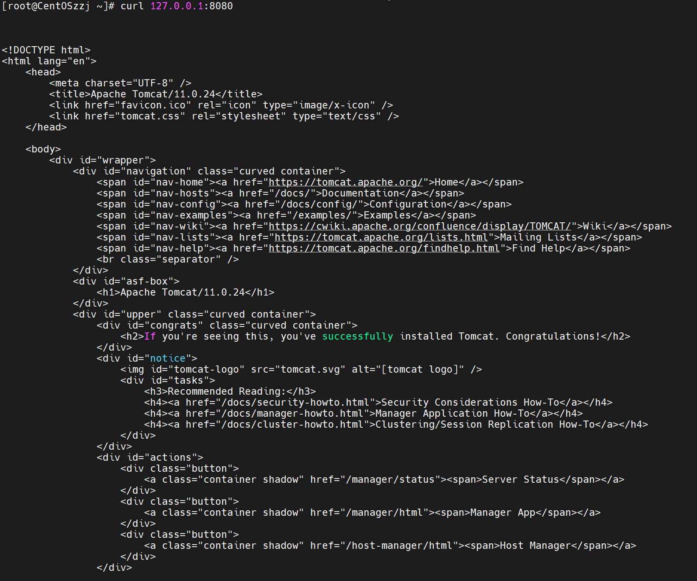

主机内可以访问？

查看防火墙

```shell
firewall-cmd --list-ports
```


其实是防火墙没有放行

放行8080端口，重新加载防火墙使其生效

```shell
firewall-cmd --add-port=8080/tcp --permanent
firewall-cmd --reload
```

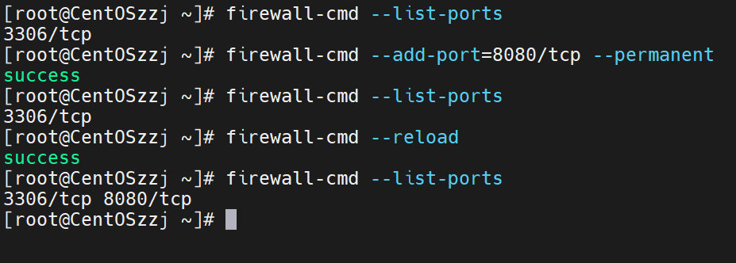

去外部浏览器刷新即可看到Tomcat网页

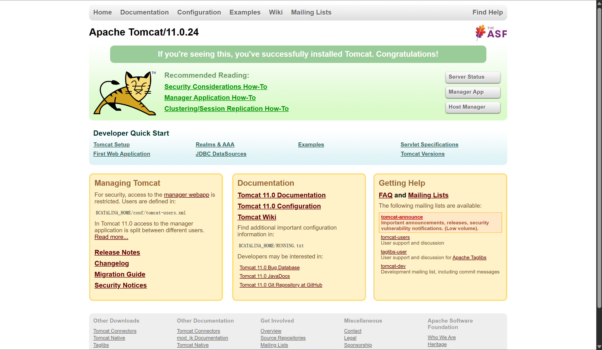

### 关闭Tomcat

```shell
cd tomcat11/bin
./shutdown.sh
```

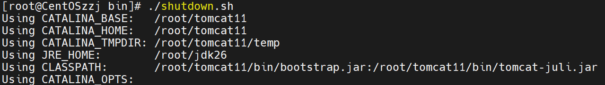
