# Zabbix

你还在使用top看服务器资源吗

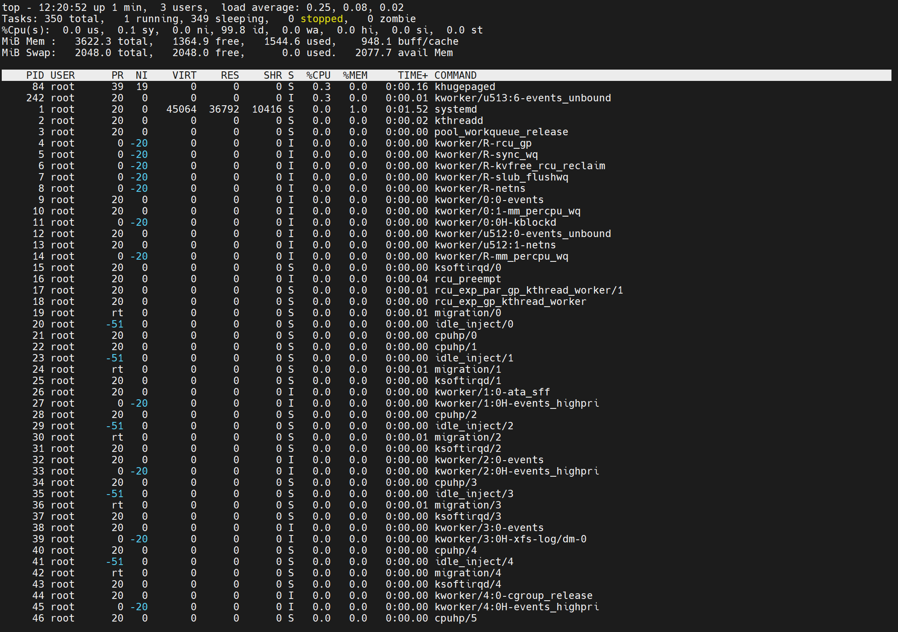

传统的top命令，界面杂乱，功能单一，能量微小。。。[悲~]	(╥_╥)

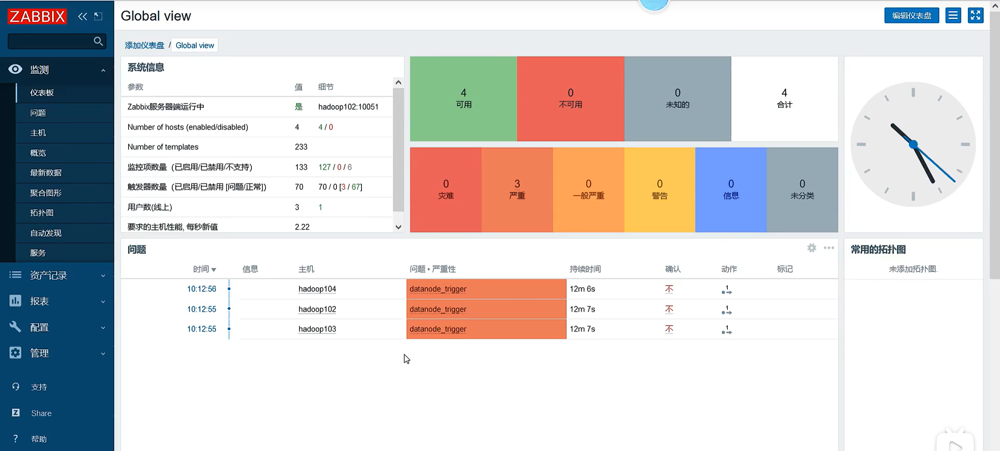

使用Zabbix监控，自动化监控，友好UI交互界面，告警提示，能量巨大！！！[狂喜——]	₍^ >ヮ<^₎ .ᐟ.ᐟ

浏览器搜索“zabbix”

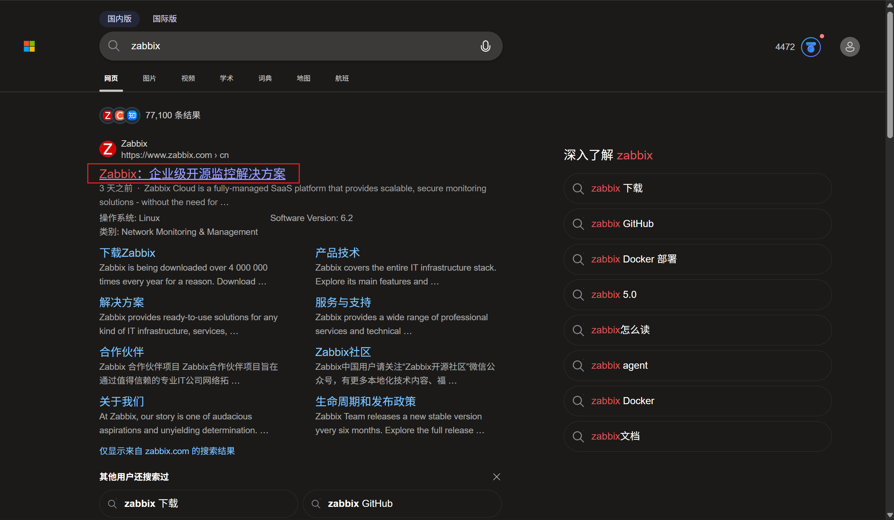

打开官网，点击“下载zabbix”

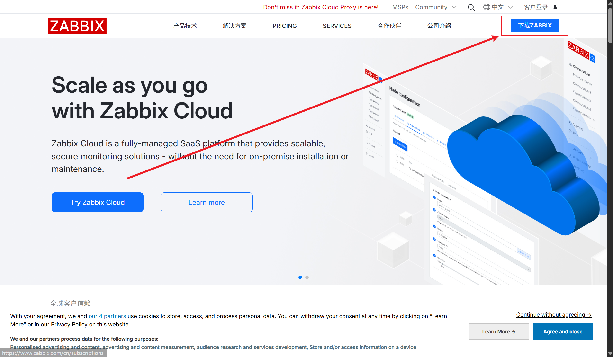

选择“Zabbix Packages”  包安装

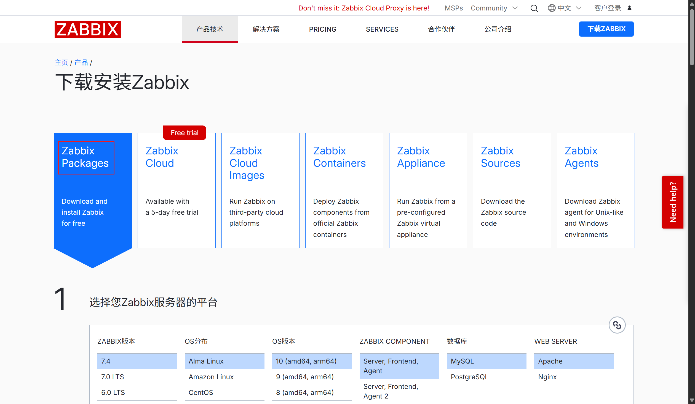

## 选择版本

zabbix直接冲最新7.4

目前我的服务器为CentOS Stream 10，版本选择如下：

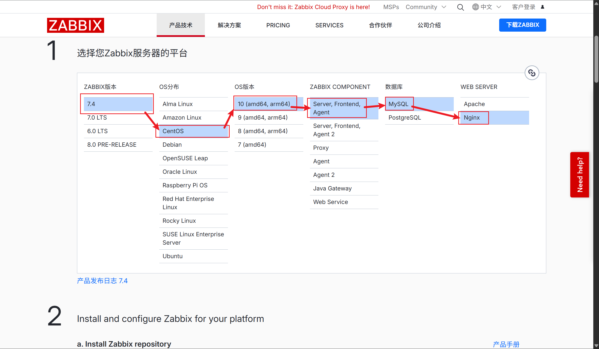

注意到，还需要MySQL和Nginx，以下提供一键安装脚本，只适用于和我同款的CentOS Stream 10

版本不一样的请参考：

安装MySQL：https://github.com/zzj081308/linux/blob/main/MySQL/MySQL.md

安装Nginx：https://github.com/zzj081308/linux/blob/main/Nginx/Nginx.md

## 安装MySQL

install_MySQL9.7.sh：

```shell
#!/bin/bash
echo "hello world!"
echo "现在开始安装MySQL9.7"
echo "添加官方源"
dnf -y install https://dev.mysql.com/get/mysql97-community-release-el10-1.noarch.rpm
echo "开始安装MySQL服务"
dnf -y install mysql-community-server --setopt=install_weak_deps=False
echo "启动MySQL服务"
systemctl start mysqld
echo "设置服务自启动"
systemctl enable mysqld
echo "当前服务状态"
systemctl status mysqld --no-pager
echo "获取临时密码"
cat /var/log/mysqld.log | grep "password"
echo "开始截取"
temp_password=$(grep 'temporary password' /var/log/mysqld.log | awk -F " " '{print $NF}')
echo "临时密码为：${temp_password}"
echo "修改密码为：Zzj20050521@"
mysql -u root --password="$temp_password" --connect-expired-password -e "ALTER USER 'root'@'localhost' IDENTIFIED BY 'Zzj20050521@';"
```

## 安装Nginx

Nginx_install.sh：

```shell
#!/bin/bash
echo "开始安装Nginx"
echo "安装yum-utils组件"
yum -y install yum-utils
echo "写入repo仓库配置"
cat > /etc/yum.repos.d/nginx.repo << 'EOF'
[nginx-stable]
name=nginx stable repo
baseurl=https://nginx.org/packages/centos/$releasever/$basearch/
gpgcheck=1
enabled=1
gpgkey=https://nginx.org/keys/nginx_signing.key
module_hotfixes=true

[nginx-mainline]
name=nginx mainline repo
baseurl=https://nginx.org/packages/mainline/centos/$releasever/$basearch/
gpgcheck=1
enabled=0
gpgkey=https://nginx.org/keys/nginx_signing.key
module_hotfixes=true
EOF
echo "开始安装Nginx"
yum install -y nginx
systemctl start nginx
firewall-cmd --add-port=80/tcp --permanent
firewall-cmd --reload
```

## 安装zabbix

现在安装zabbix，根据官方安装文档还需查看EPEL

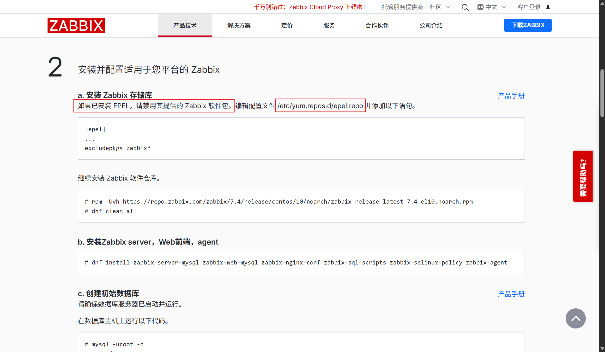

查看仓库

```shell
ls /etc/yum.repos.d/
```

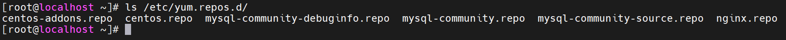

然而并没有epel.repo

### 安装Zabbix仓库

那就跳过开始安装zabbix仓库并清除缓存

```shell
rpm -Uvh https://repo.zabbix.com/zabbix/7.4/release/centos/10/noarch/zabbix-release-latest-7.4.el10.noarch.rpm
dnf clean all
```

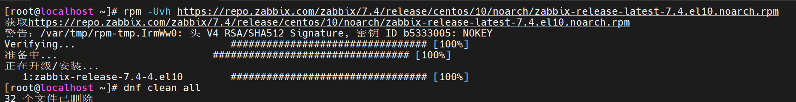

安装server、Web UI、agent

```shell
dnf install zabbix-server-mysql zabbix-web-mysql zabbix-nginx-conf zabbix-sql-scripts zabbix-selinux-policy zabbix-agent
```

主机也要监控的，自己看自己，所以也要装agent

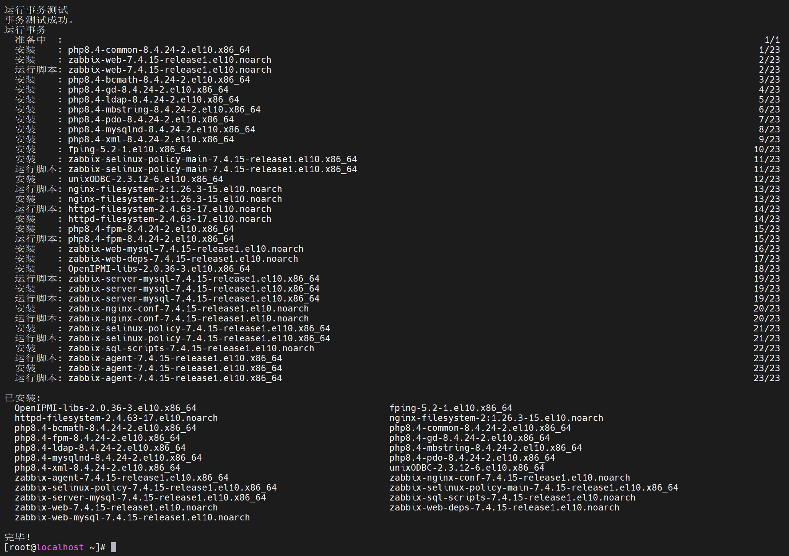

安装完了

### 创建初始数据库

```shell
mysql -uroot -p
[密码]
```

运行以下sql语句，创建初始环境

```mysql
create database zabbix character set utf8mb4 collate utf8mb4_bin;
create user zabbix@localhost identified by 'password';
grant all privileges on zabbix.* to zabbix@localhost;
set global log_bin_trust_function_creators = 1;
quit;
```

设置密码要含有大小写加符号

此处的用户将用于前端登录

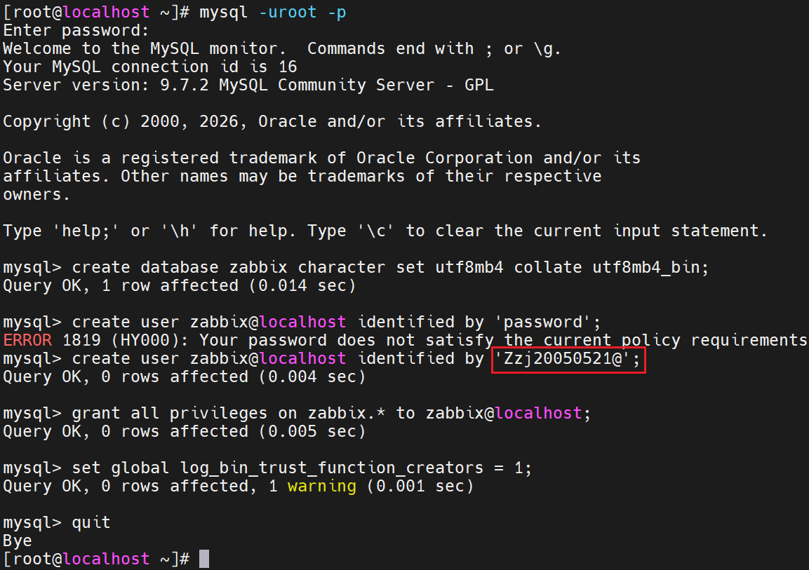

然后导入初始架构和数据，输入刚设置的密码

```shell
zcat /usr/share/zabbix/sql-scripts/mysql/server.sql.gz | mysql --default-character-set=utf8mb4 -uzabbix -p zabbix
```

再进入mysql，禁用 log_bin_trust_function_creators 选项

```shell
mysql -uroot -p
[密码]
```

```mysql
set global log_bin_trust_function_creators = 0;
quit;
```

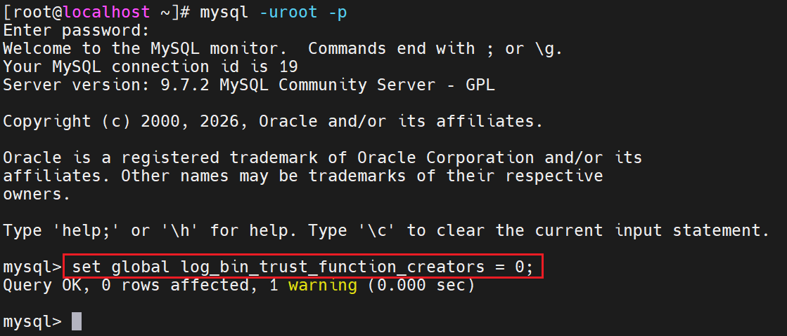

### 为Zabbix server配置数据库

编辑配置文件 /etc/zabbix/zabbix_server.conf

```shell
vim /etc/zabbix/zabbix_server.conf
```

去设置密码，DBPassword在124行

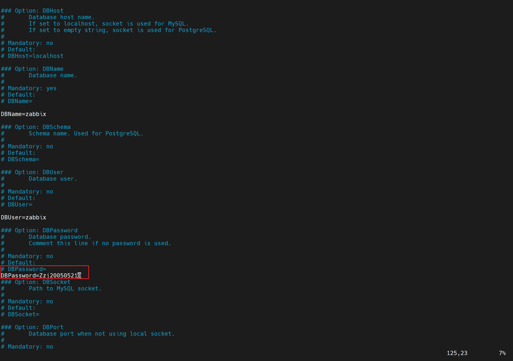

保存退出

### 为Zabbix前端配置PHP

编辑配置文件 /etc/nginx/conf.d/zabbix.conf

```shell
vim /etc/nginx/conf.d/zabbix.conf
```

设置端口和域名

```shell
listen 8080;
server_name 192.168.40.128;
```

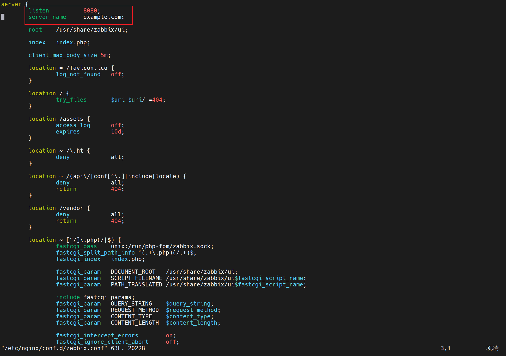

## 启动Zabbix

启动Zabbix server和agent进程，并为它们设置开机自启：

```shell
systemctl restart zabbix-server zabbix-agent nginx php-fpm
systemctl enable zabbix-server zabbix-agent nginx php-fpm
```

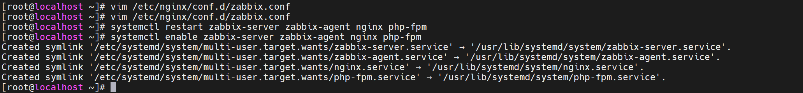

### 登陆前端

登陆前端：192.168.40.128:8080

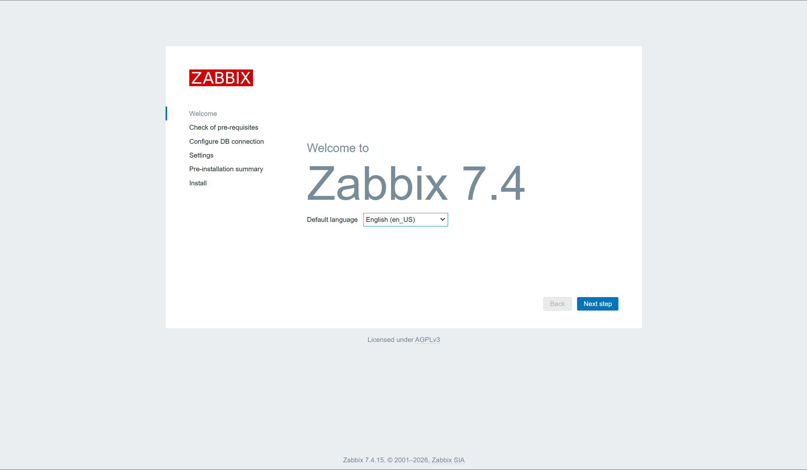

查看配置

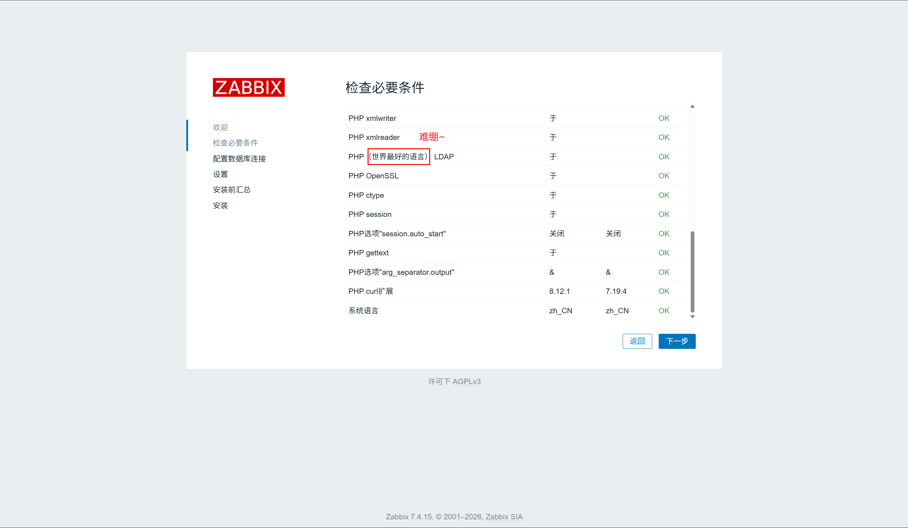

### 连接数据库

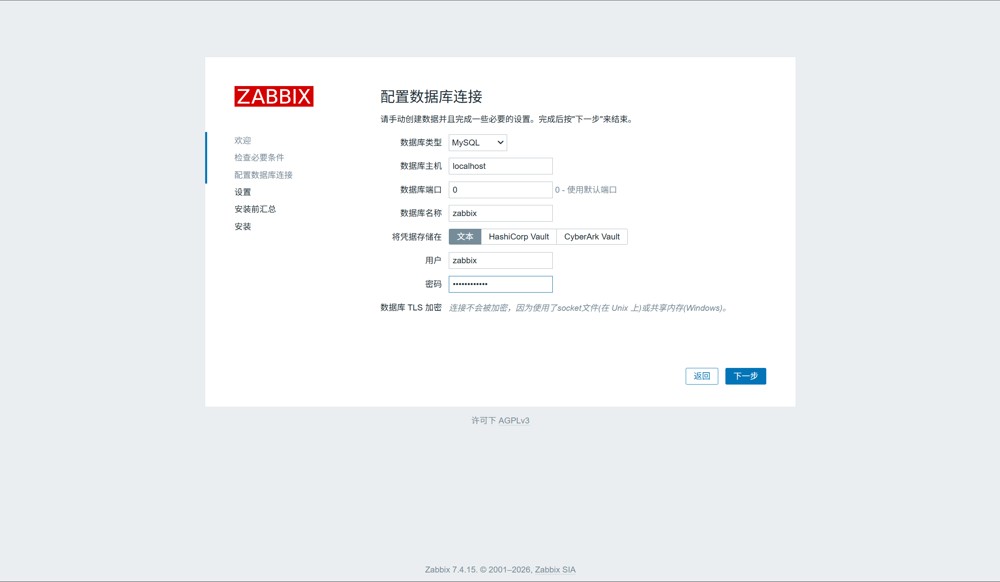

### 设置主机名、时区

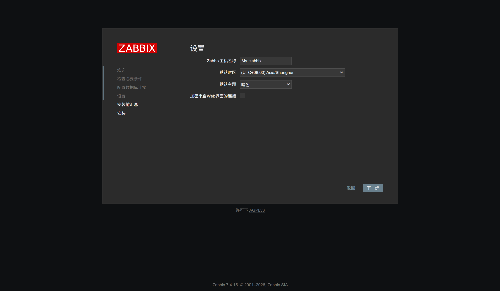

### 查看配置

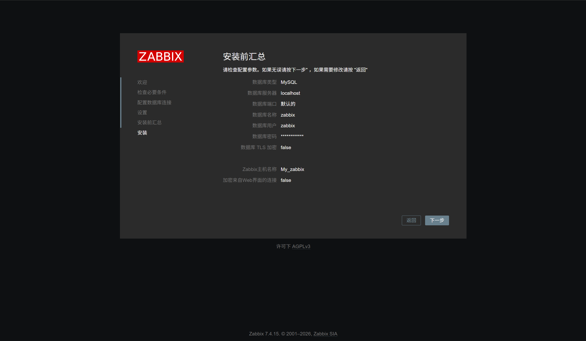

前端就配置完了

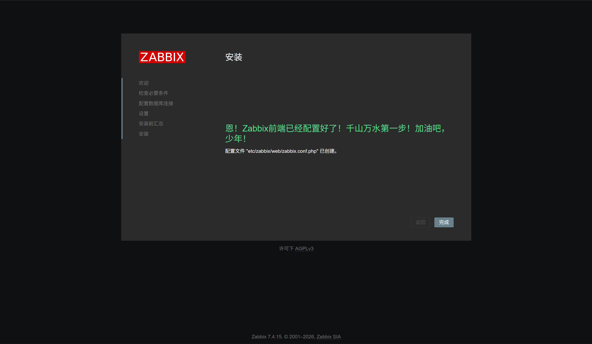

## 登陆Zabbix

默认用户名:Admin

默认密码:zabbix

登陆！

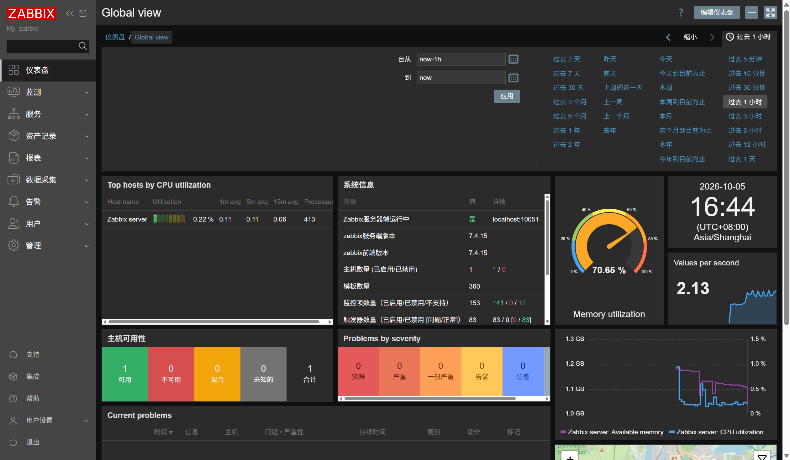

我去太帅了