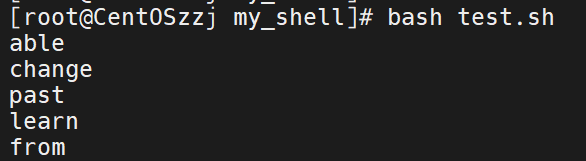
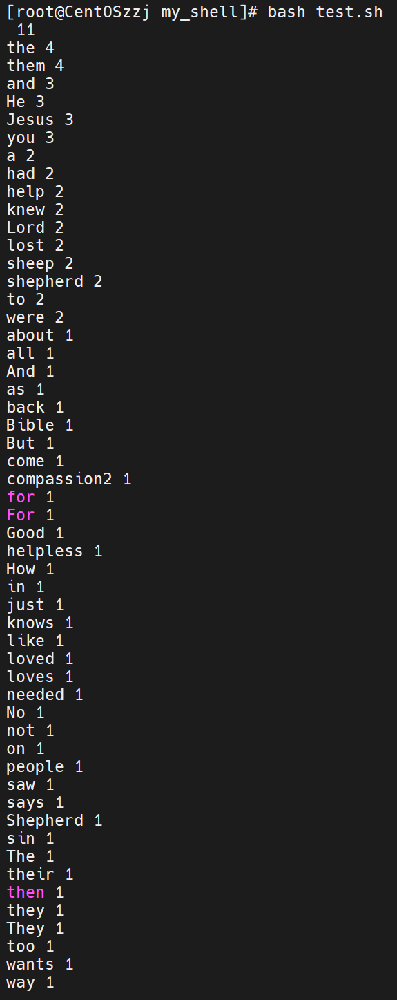
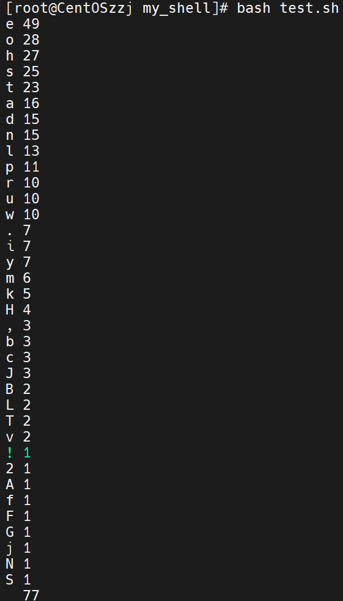
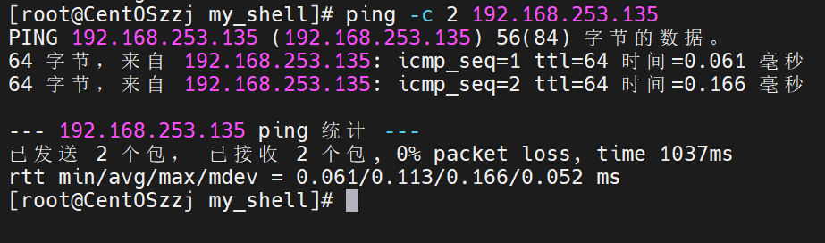
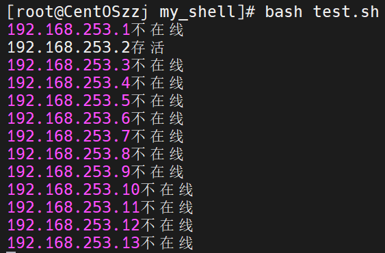
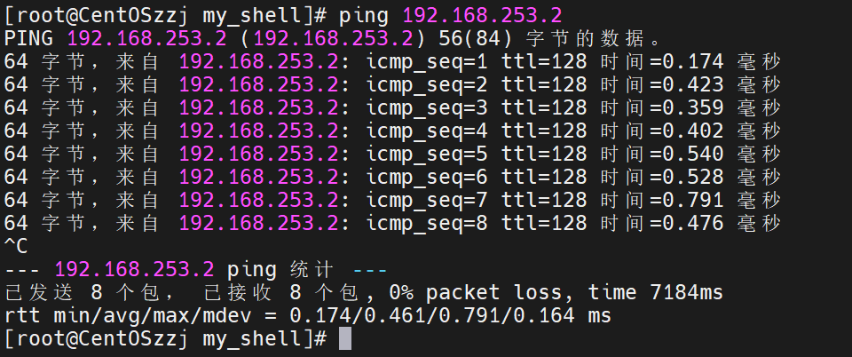

# shell综合

## 一、查空行

查询一个文件中的空行

准备文件test.txt，写一点内容

```shell
#!/bin/bash
# 查空行
cat > test.txt << EOF
zzj zzj

hmh
666

zzj
EOF
```


现在查询空行

/^$/匹配空行，NR打印行号

```shell
awk '/^$/{printf("空行行号:%s\n", NR)}' test.txt
```

```shell
#!/bin/bash
# 查空行
cat > test.txt << EOF
zzj zzj

hmh
666

zzj
EOF
echo "查空行:"
awk '/^$/{printf("空行行号:%s\n", NR)}' test.txt
```


## 二、求一列的和

求文件中一列内容的和

准备文件test.txt

```shell
#!/bin/bash
# 求一列的和
cat > test.txt << EOF
zzj 91
hmh 92
yyl 93
EOF
```


求第二列的和

-F " "空格分隔，-v sum=0自定义变量sum=0

{sum+=$2}加上每行第二列

输出sum

```shell
awk -F " " -v sum=0 '{sum+=$2}END{printf("求和结果%s\n", sum)}' test.txt
```


```shell
#!/bin/bash
# 求一列的和
cat > test.txt << EOF
zzj 91
hmh 92
yyl 93
EOF
echo "第二列求和:"
awk -F " " -v sum=0 '{sum+=$2}END{printf("求和结果%s\n", sum)}' test.txt
```

## 三、检查文件是否存在

简单用判断-e即可

```shell
#!/bin/bash
# 查询文件是否存在
if [ -e /root/my_shell/test.txt ]
then
        echo "文件存在"
else
        echo "文件不存在"
fi
```


## 四、数字排序

test.txt如下

```shell
#!/bin/bash
# 文本排序
cat >> test.txt < EOF
2
4
5
3
1
7
6
EOF
```

sort排序

```shell
sort -k1,1n test.txt
```

```shell
#!/bin/bash
# 文本排序
cat > test.txt << EOF
2
4
5
3
1
7
6
EOF

echo "排序前:" `cat test.txt`
echo "排序后:"
sort -k1,1n test.txt
```


## 五、搜索指定目录下文件的内容

查找/root下含有“123”的内容

```shell
grep -r "123" /root
```


## 六、批量生成文件名

批量生产指定数目的文件，以纳秒命名

先创建一个整形变量

```shell
declare -i n
```

设置接受的文件数目

```shell
read -t 30 -p "请输入创建文件的数目:" n
```

获取纳秒

```shell
name=$(date +%N)
```

设置循环，循环内判断：如果目录不存在则创建目录在创建文件，否则直接创建文件

```shell
for((i = 0; i < $n; i++))
do
        name=$(date +%N)
        if [ ! -d /root/my_shell/zzj ]
        then
                mkdir /root/my_shell/zzj
                touch /root/my_shell/zzj/$name
                echo "创建文件$name"
        else
                touch /root/my_shell/zzj/$name
                echo "创建文件$name"
        fi
done
```

执行


## 七、批量改名

批量改名.root.my_shell/zzj目录下的文件 

先获取文件名列表

```shell
filenames=$(ls /root/my_shell/zzj)
```

批量改名

```shell
rename ${name} ${newname} /root/my_shell/zzj/*
```

```shell
#!/bin/bash
# 批量改名./zzj下的文件
filenames=$(ls /root/my_shell/zzj)
num=1
for name in $filenames
do
        printf "重命名前:%s\n" ${name}
        newname=${name}"-"${num}
        let num++
        rename ${name} ${newname} /root/my_shell/zzj/*
        printf "重命名后:%s\n" ${newname}
done

```


## 八、批量创建用户

根据test.txt中提供的用户名批量创建用户

```shell
#!/bin/bash
# 批量创建用户
cat > test.txt << EOF
user1
user2
EOF
```

添加用户命令

```shell
useradd 用户名
```

给用户设置密码

```shell
echo "密码" | passwd -stdin user1
```

删除用户以及主目录

```shell
userdel -r 用户名
```

```shell
#!/bin/bash
# 批量创建用户
cat > test.txt << EOF
user1
user2
EOF

# 创建用户列表
ULIST=$(cat /root/my_shell/test.txt)
for UNAME in $ULIST
do
        useradd $UNAME
        echo "Hmh12345678@" | passwd --stdin $UNAME
        if [[ $? == 0 ]]
        then
                echo "执行$UNAME成功"
        else
                echo "执行$UNAME失败"
        fi
done

```


## 九、筛选单词

数据准备test.txt

筛选出长度大于3的单词

```shell
#!/bin/bash
# 单词筛选
cat > test.txt << EOF
I may not be able to change the past, but I can learn from it.
EOF

```

awk指定分隔符为：空格，.

```shell
#!/bin/bash
# 单词筛选
cat > test.txt << EOF
I may not be able to change the past, but I can learn from it.
EOF

awk -F "[ ,.]" '{for(i=1;i<=NF;i++){if(length($i)>3)print $i}}' test.txt

```



## 十、单词字母去重排序

```shell
#!/bin/bash
# 单词筛选
cat > test.txt << EOF
No. The Bible says Jesus had compassion2 on them for He saw them as sheep without a shepherd. They were like lost sheep, lost in their sin. How the Lord Jesus loved them! He knew they were helpless and needed a shepherd. And the Good Shepherd knew He had come to help them. But not just the people way back then. For the Lord Jesus knows all about you, and loves you too, and wants to help you.
EOF
```

对单词进行统计

用一个关联数组S[$i]++进行统计

```shell
{for(i=1;i<=NF;i++){S[$i]++}}'
```

```shell
awk -F "[ ,.!]" '{for(i=1;i<=NF;i++){S[$i]++}}END{for(key in S){printf("%s %s\n", key, S[key])}}' test.txt | sort -t " " -k2,2rn
```

```shell
#!/bin/bash
# 单词筛选
cat > test.txt << EOF
No. The Bible says Jesus had compassion2 on them for He saw them as sheep without a shepherd. They were like lost sheep, lost in their sin. How the Lord Jesus loved them! He knew they were helpless and needed a shepherd. And the Good Shepherd knew He had come to help them. But not just the people way back then. For the Lord Jesus knows all about you, and loves you too, and wants to help you.
EOF

awk -F "[ ,.!]" '{for(i=1;i<=NF;i++){S[$i]++}}END{for(key in S){printf("%s %s\n", key, S[key])}}' test.txt | sort -t " " -k2,2rn

```



如果要按字母分，把分隔符删掉就行

```shell
awk -F "" '{for(i=1;i<=NF;i++){S[$i]++}}END{for(key in S){printf("%s %s\n", key, S[key])}}' test.txt | sort -t " " -k2,2rn
```



## 十一、扫描网络内存活的主机

ping一下我的网卡



发两个包只要接收到一个就算存活

```shell
#!/bin/bash
# 检测网络内存活的主机
count=0
for i in 192.168.253.{1..254}
do
        num=$(ping -c 2 $i | awk -F " " 'NR==6{printf("%s", $5)}')
        if (( num > 0 ))
        then
                echo "$i存活"
        else
                echo "$i不在线"
        fi
done

```





可见192.168.253.135确实在线
