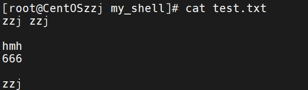
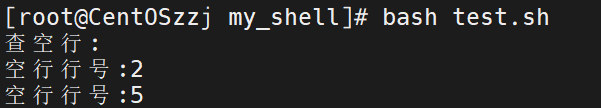
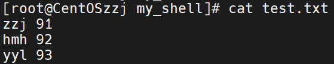
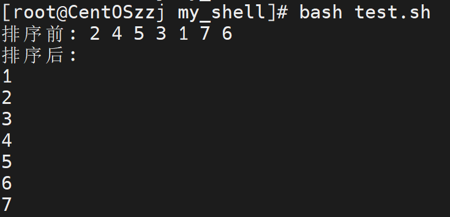
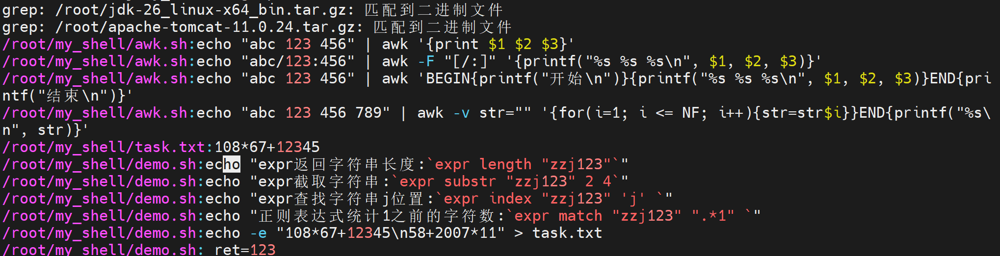
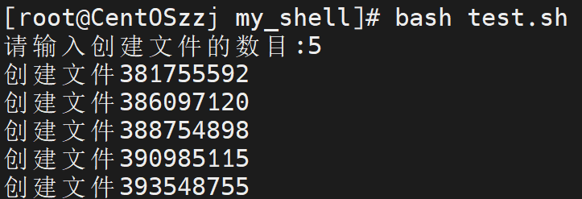
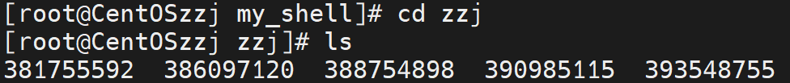
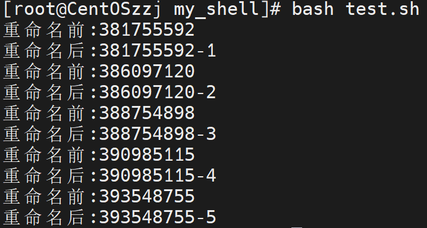

# shell综合

## 一、查空行

查询一个文件中的空行

准备文件test.txt，写一点内容

```shell
#!/bin/bash
# 查空行
cat > test.txt << EOF
zzj zzj

hmh
666

zzj
EOF
```



现在查询空行

/^$/匹配空行，NR打印行号

```shell
awk '/^$/{printf("空行行号:%s\n", NR)}' test.txt
```

```shell
#!/bin/bash
# 查空行
cat > test.txt << EOF
zzj zzj

hmh
666

zzj
EOF
echo "查空行:"
awk '/^$/{printf("空行行号:%s\n", NR)}' test.txt
```



## 二、求一列的和

求文件中一列内容的和

准备文件test.txt

```shell
#!/bin/bash
# 求一列的和
cat > test.txt << EOF
zzj 91
hmh 92
yyl 93
EOF
```



求第二列的和

-F " "空格分隔，-v sum=0自定义变量sum=0

{sum+=$2}加上每行第二列

输出sum

```shell
awk -F " " -v sum=0 '{sum+=$2}END{printf("求和结果%s\n", sum)}' test.txt
```


```shell
#!/bin/bash
# 求一列的和
cat > test.txt << EOF
zzj 91
hmh 92
yyl 93
EOF
echo "第二列求和:"
awk -F " " -v sum=0 '{sum+=$2}END{printf("求和结果%s\n", sum)}' test.txt
```

## 三、检查文件是否存在

简单用判断-e即可

```shell
#!/bin/bash
# 查询文件是否存在
if [ -e /root/my_shell/test.txt ]
then
        echo "文件存在"
else
        echo "文件不存在"
fi
```


## 四、数字排序

test.txt如下

```shell
#!/bin/bash
# 文本排序
cat >> test.txt < EOF
2
4
5
3
1
7
6
EOF
```

sort排序

```shell
sort -k1,1n test.txt
```

```shell
#!/bin/bash
# 文本排序
cat > test.txt << EOF
2
4
5
3
1
7
6
EOF

echo "排序前:" `cat test.txt`
echo "排序后:"
sort -k1,1n test.txt
```



## 五、搜索指定目录下文件的内容

查找/root下含有“123”的内容

```shell
grep -r "123" /root
```



## 六、批量生成文件名

批量生产指定数目的文件，以纳秒命名

先创建一个整形变量

```shell
declare -i n
```

设置接受的文件数目

```shell
read -t 30 -p "请输入创建文件的数目:" n
```

获取纳秒

```shell
name=$(date +%N)
```

设置循环，循环内判断：如果目录不存在则创建目录在创建文件，否则直接创建文件

```shell
for((i = 0; i < $n; i++))
do
        name=$(date +%N)
        if [ ! -d /root/my_shell/zzj ]
        then
                mkdir /root/my_shell/zzj
                touch /root/my_shell/zzj/$name
                echo "创建文件$name"
        else
                touch /root/my_shell/zzj/$name
                echo "创建文件$name"
        fi
done
```

执行





## 七、批量改名

批量改名.root.my_shell/zzj目录下的文件 

先获取文件名列表

```shell
filenames=$(ls /root/my_shell/zzj)
```

批量改名

```shell
rename ${name} ${newname} /root/my_shell/zzj/*
```

```shell
#!/bin/bash
# 批量改名./zzj下的文件
filenames=$(ls /root/my_shell/zzj)
num=1
for name in $filenames
do
        printf "重命名前:%s\n" ${name}
        newname=${name}"-"${num}
        let num++
        rename ${name} ${newname} /root/my_shell/zzj/*
        printf "重命名后:%s\n" ${newname}
done

```



## 八、批量创建用户
