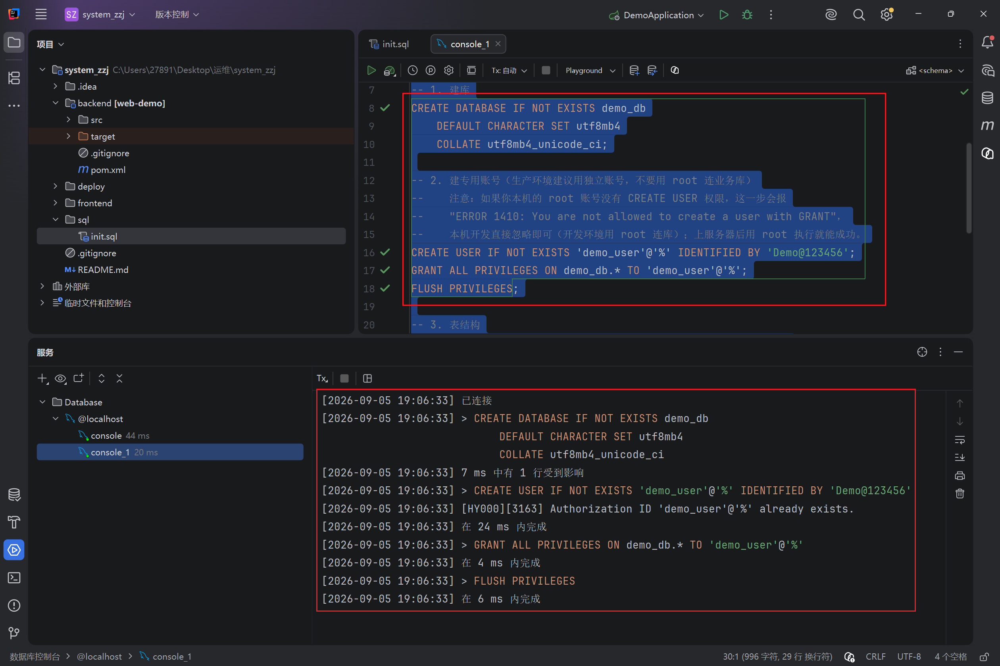
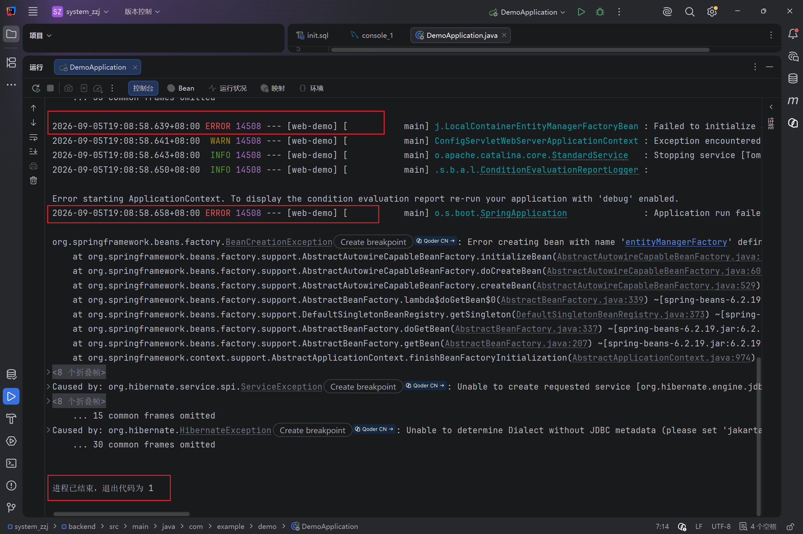
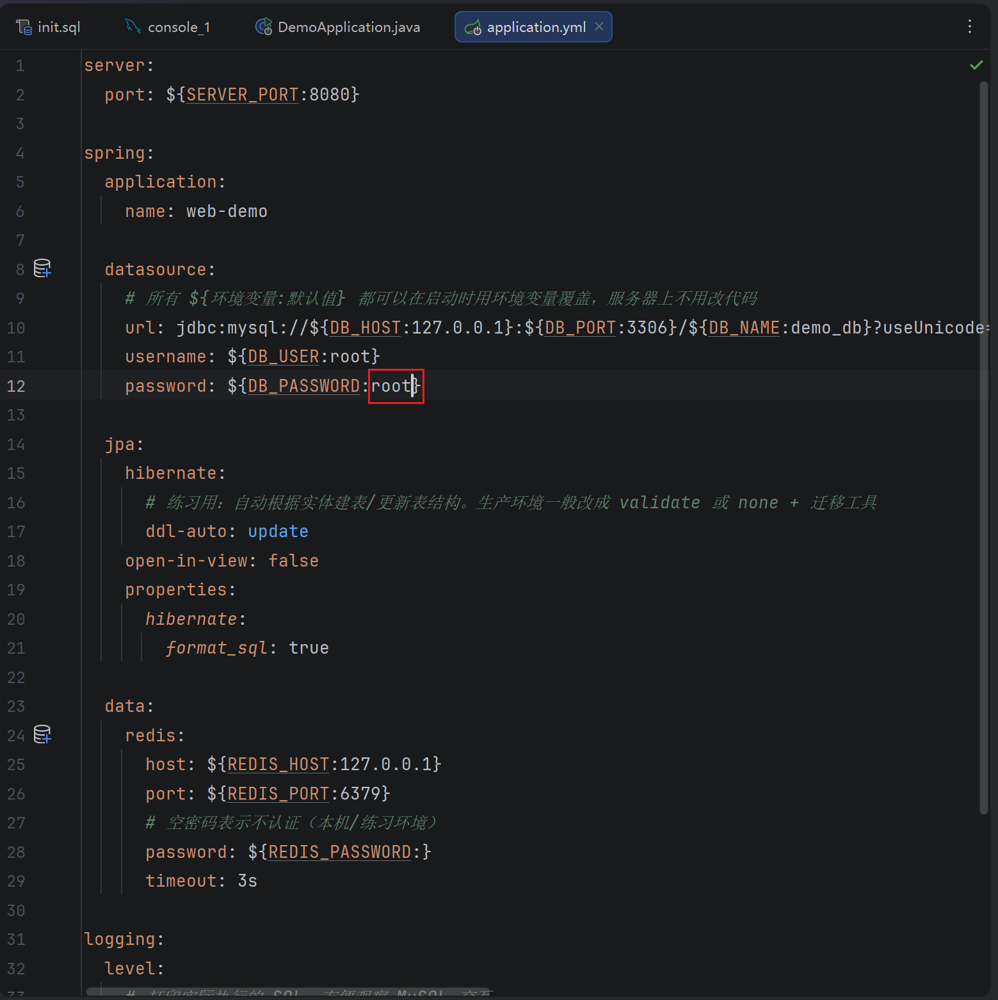
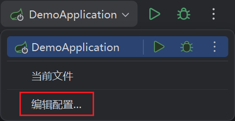
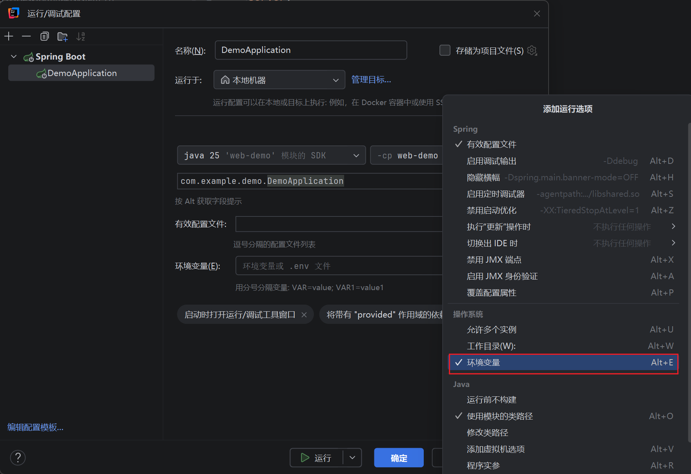
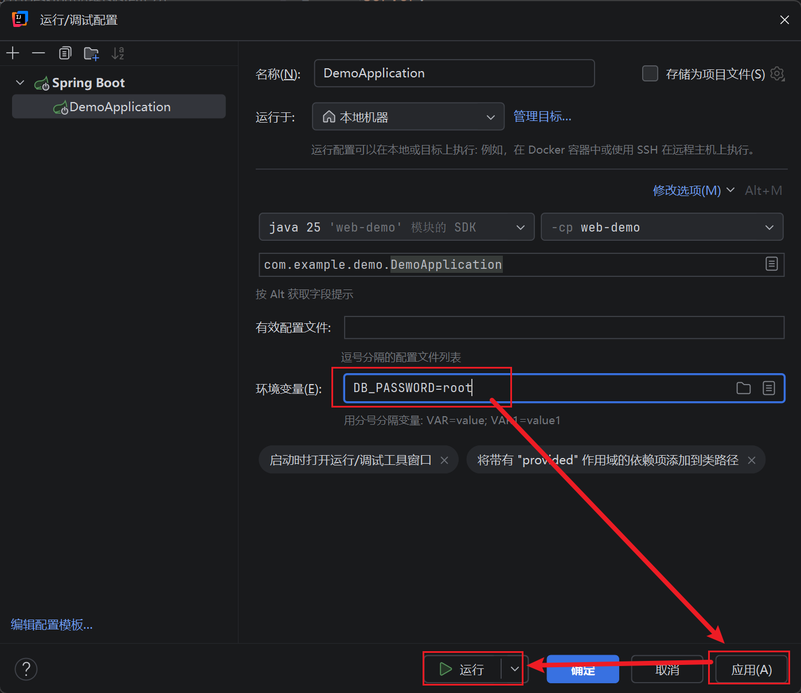
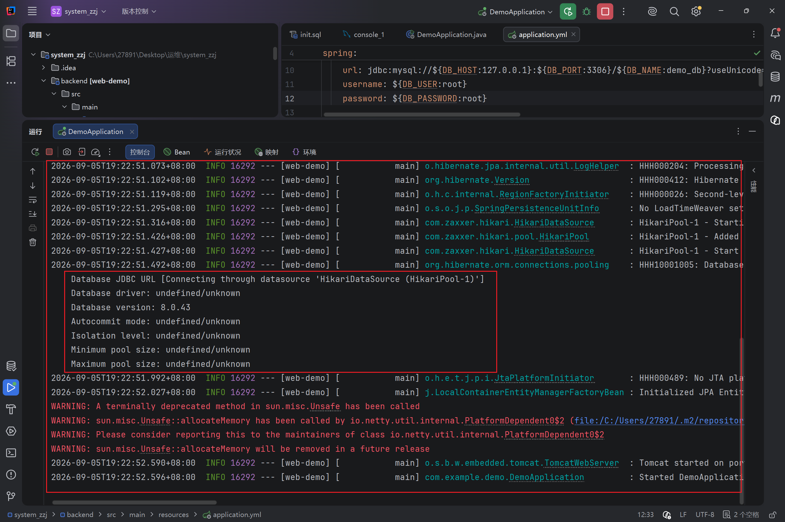
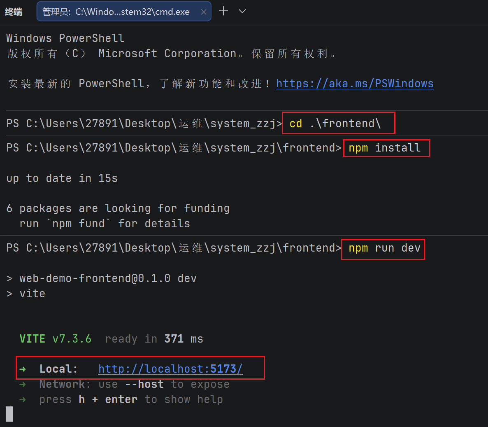
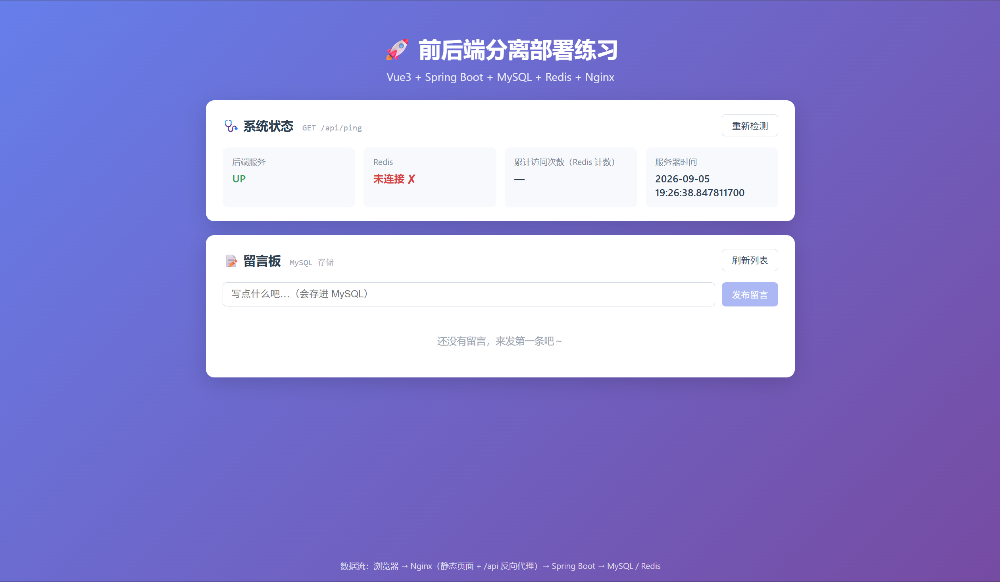

# 服务器部署网页

以下将演示三台服务器共同部署一个简单网页项目

服务器1：

ubuntu-24.04.3-desktop-amd64	4核4g	部署Java Spring boot

服务器2：

CentOS-Stream-10	3核4g	部署Mysql

服务器3：

CentOS-Stream-10 3核2g	部署Nginx+Redis

首先准备网页项目：system_zzj

项目由deepseek v4 pro harness编写

## windows 11运行

先放我windows 11 环境测试运行：

先进入加载Maven

### 加载数据库

执行sql



### 运行后端

运行后端DemoApplication

发现报错



实际是ai编写yml配置里的Mysql密码错误用了环境变量DB_PASSWORD=root未加载以及测试用的密码123456

把密码改成root就行



或者idea加载环境变量



选择编辑配置



勾选环境变量，添加一条

DB_PASSWORD=root



应用运行就行

后端运行成功



### 运行前端

```vue
cd .\frontend\
npm install
npm run dev
```



打开网页



## 服务器2部署Mysql

这边参考我的安装文档：https://github.com/zzj081308/linux/blob/main/MySQL/MySQL.md