# 服务器部署网页

以下将演示三台服务器共同部署一个简单网页项目

服务器1：

ubuntu-24.04.3-desktop-amd64	4核4g	192.168.253.128	部署Java Spring boot

服务器2：

CentOS-Stream-10	3核4g	192.168.253.135	部署Mysql

服务器3：

CentOS-Stream-10 3核2g	192.168.253.136	部署Nginx+Redis

首先准备网页项目：system_zzj

项目由deepseek v4 pro harness编写

## windows 11运行

先放我windows 11 环境测试运行：

先进入加载Maven

### 加载数据库

执行sql


### 运行后端

运行后端DemoApplication

发现报错


实际是ai编写yml配置里的Mysql密码错误用了环境变量DB_PASSWORD=root未加载以及测试用的密码123456

把密码改成root就行


或者idea加载环境变量


选择编辑配置


勾选环境变量，添加一条

DB_PASSWORD=root


应用运行就行

后端运行成功


### 运行前端

```vue
cd .\frontend\
npm install
npm run dev
```


打开网页


## 服务器2部署Mysql

这边参考我的安装文档：

```http
https://github.com/zzj081308/linux/blob/main/MySQL/MySQL.md
```

获取到yum仓库地址：

```http
https://dev.mysql.com/get/mysql97-community-release-el10-1.noarch.rpm
```

### 获取官方yum仓库

```shell
yum -y install https://dev.mysql.com/get/mysql97-community-release-el10-1.noarch.rpm
```

查看官方源是否启用

```shell
yum repolist enabled | grep mysql
```

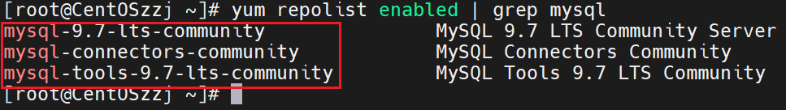

已经启用

### 安装Mysql服务

开始安装Mysql服务

```shell
yum -y install mysql-community-server --setopt=install_weak_deps=False
```

--setopt=install_weak_deps=False

临时修改 yum 的一个配置项：**本次安装不装“弱依赖”**

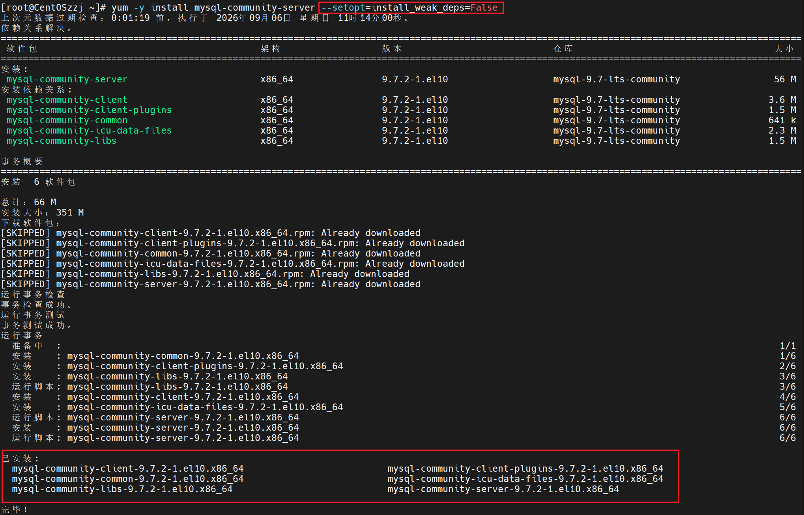

### 开启服务

开启MySQL服务，并开启开机自启

检查状态

```
systemctl start mysqld
systemctl enable mysqld
systemctl status mysqld
```

设置开机自启动

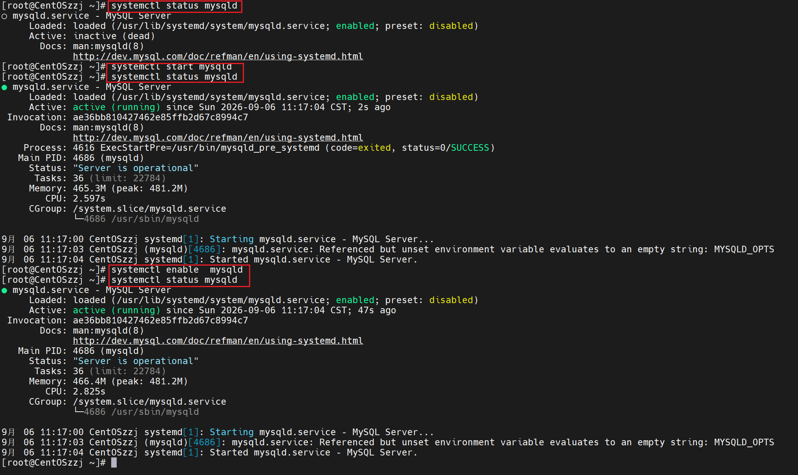

### 配置Mysql

寻找临时密码

```shell
cat /var/log/mysqld.log
```

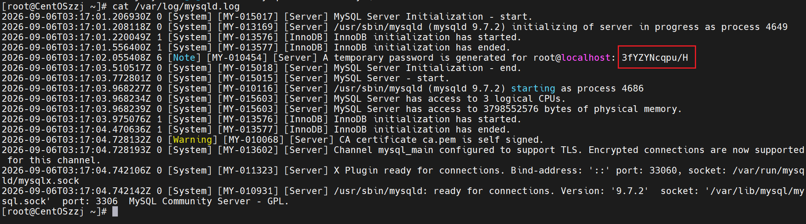

获取到密码

```
3fYZYNcqpu/H
```

登录mysql

```shell
mysql -uroot -p
```

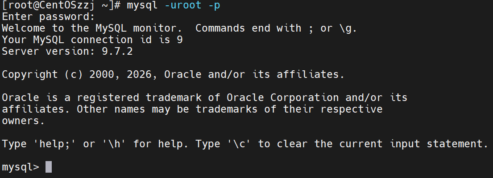

修改密码

```mysql
ALTER USER 'root'@'localhost' IDENTIFIED BY 'Zzj20050521@';
```

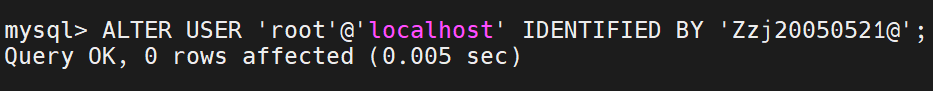

至此Mysql安装完成

### 数据库创建

把项目的init.sql上传到服务器2

```shell
mysql -uroot -pZzj20050521@ < init.sql
```

执行init.sql

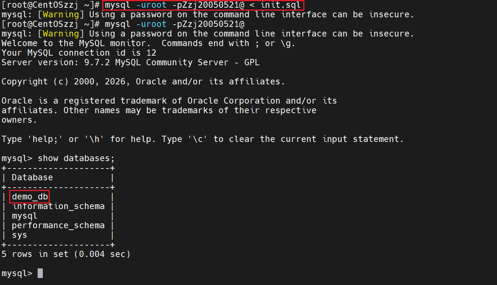

可见数据库已经建好

## 服务器3部署Nginx

### 建nginx仓库文件

先去yum仓库新建一个nginx仓库文件

```shell
cd /etc/yum.repos.d/
vim nginx.repo
```

### 写仓库文件配置

写下如下配置文件

```nginx
[nginx-stable] 
name=nginx stable repo 
baseurl=https://nginx.org/packages/centos/$releasever/$basearch/ 
gpgcheck=1 
enabled=1 
gpgkey=https://nginx.org/keys/nginx_signing.key 
module_hotfixes=true 

[nginx-mainline] 
name=nginx mainline repo 
baseurl=https://nginx.org/packages/mainline/centos/$releasever/$basearch/ 
gpgcheck=1 
enabled=0 
gpgkey=https://nginx.org/keys/nginx_signing.key 
module_hotfixes=true
```

### 安装yum-utils组件

```shell
yum -y install yum-utils
```

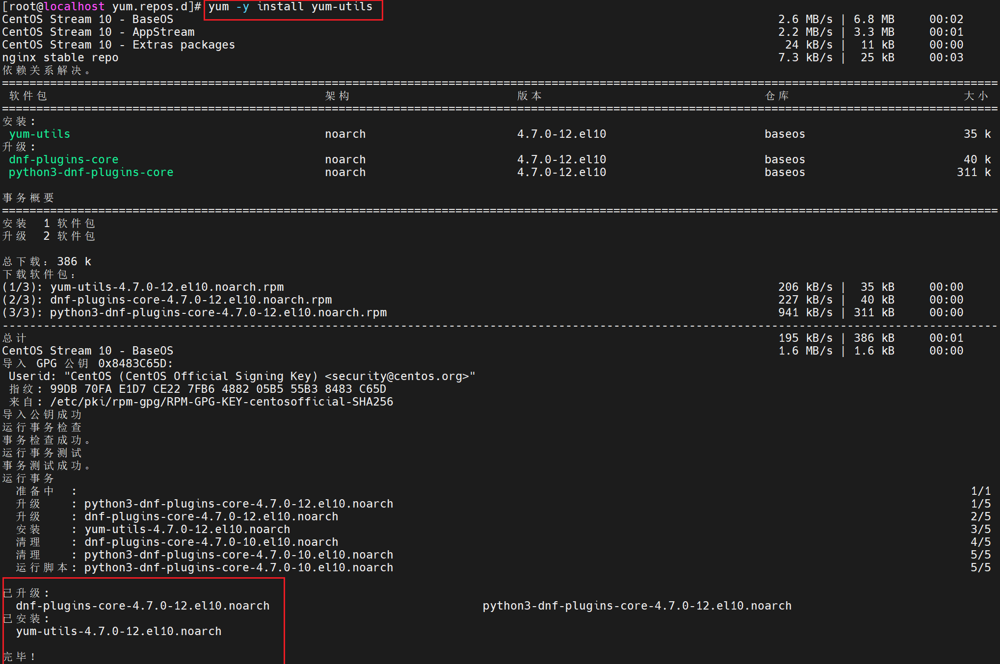

### 安装Nginx

开始安装Nginx

```shell
yum install -y nginx
```

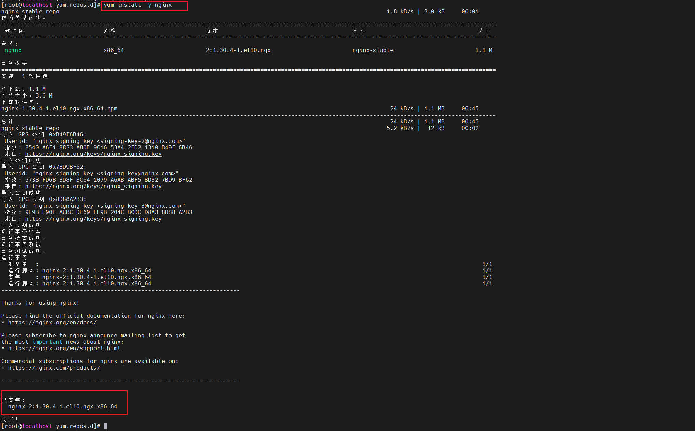

### 启动服务

```shell
systemctl start nginx
```

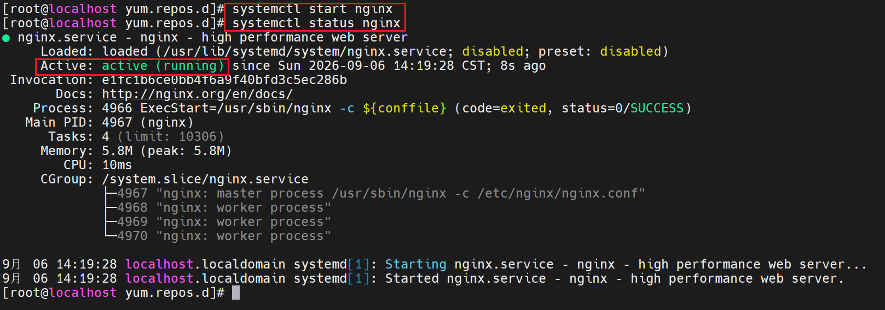

### 防火墙放行

放行80端口

```shell
firewall-cmd --add-port=80/tcp --permanent
firewall-cmd --reload
```

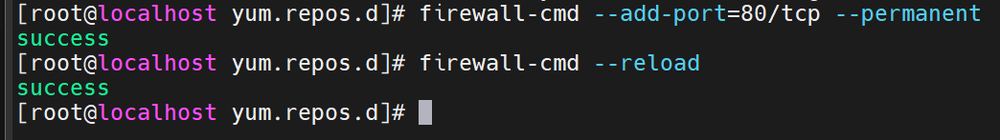

### 验证

此时在浏览器访问http://192.168.253.136:80

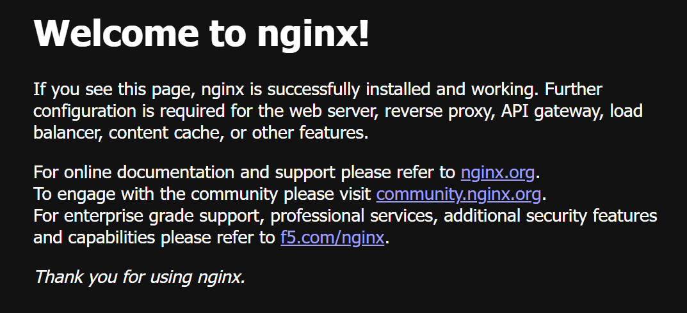

可见welcome to nginx

### 部署前端

先把项目内frontend打包上传

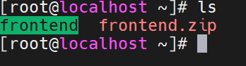

#### 创建前端文件夹

建立网站目录，把前端代码移动进去

```shell
mkdir -p /usr/share/nginx/html/web-demo
cp -r /root/frontend/dist/* /usr/share/nginx/html/web-demo/
ls /usr/share/nginx/html/web-demo
```

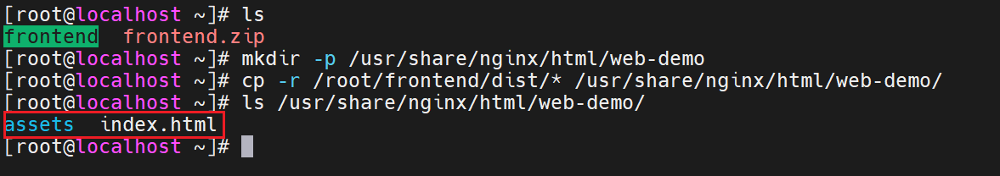

#### 修改nginx配置文件

```shell
mv /etc/nginx/conf.d/default.conf /etc/nginx/conf.d/default.conf.bak
vi /etc/nginx/conf.d/web-demo.conf
```

写入如下配置

```nginx
server {
    listen 80;
    server_name 192.168.253.136;

    root /usr/share/nginx/html/web-demo;
    index index.html;

    # 单页应用路由回退到 index.html
    location / {
        try_files $uri $uri/ /index.html;
    }

    # /api 反代到服务器1 后端——现在后端还没装，先注释掉，
    # 等后端上线再启用
    # location /api/ {
    #     proxy_pass http://192.168.253.128:8080;
    #     proxy_set_header Host $host;
    #     proxy_set_header X-Real-IP $remote_addr;
    # }
}
```

#### 重载nginx

```shell
nginx -t && systemctl reload nginx
```

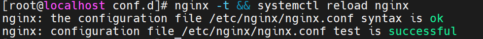

验证前端：http://192.168.253.136:80


已经可见网页

## 服务器1部署后端

### 安装jdk

使用预装open  jdk

spring版本为Spring Boot 3.5.16 最高支持到jdk25

查看apt仓库jdk

```shell
apt-cache search openjdk | grep -E 'openjdk'
```

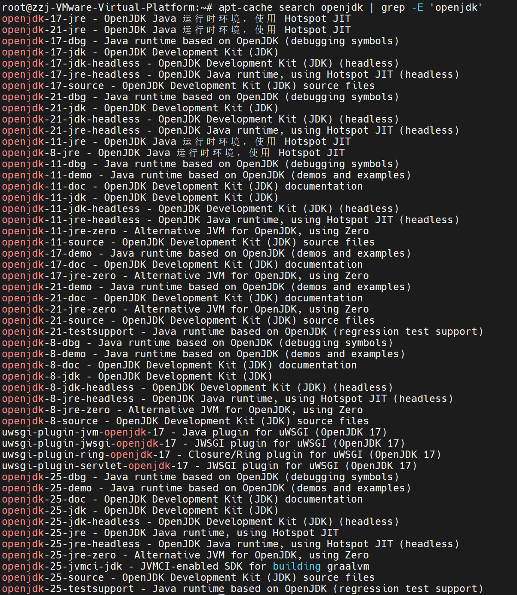

可见apt仓库有jdk8/17/21/25

直接冲jdk25

```shell
apt install -y openjdk-25-jre-headless
```

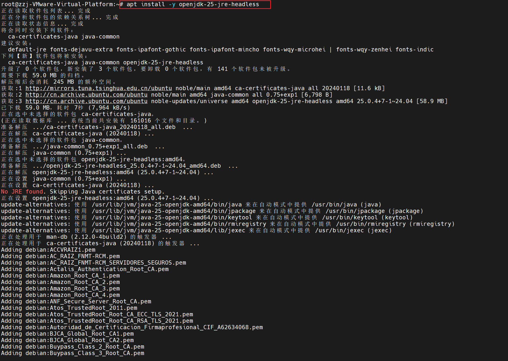

### 验证jdk安装

```shell
java --version
```

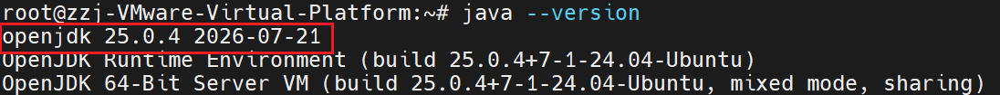

可见jdk25已经安装成功

### 部署后端

打包上传backend文件

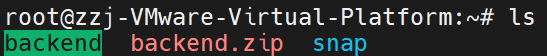

#### 创建后端文件夹

```shell
mkdir -p /opt/web-demo
```

#### 上传jar包

```shell
cp -r /root/backend/target/web-demo.jar /opt/web-demo/
```


#### 连接Mysql，运行java

远程登录暂时用不了root，先用临时用户

```shell
cd /opt/web-demo
DB_HOST=192.168.253.135 DB_USER=demo_user DB_PASSWORD='Demo@123456' java -jar web-demo.jar
```

运行发现报错，其实是Mysql防火墙没有放行3306

#### 防火墙放行3306

为了安全起见，只在服务器2放行192.168.253.128

```shell
firewall-cmd --permanent --add-rich-rule='rule family=ipv4 source address=192.168.253.128 port port=3306 protocol=tcp accept'
firewall-cmd --reload
firewall-cmd --list-all | grep 3306
```

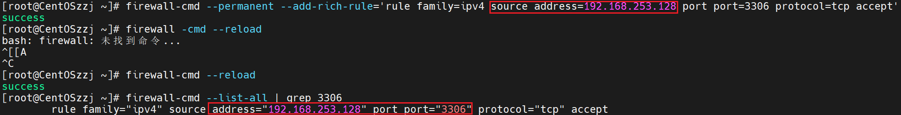

再次去服务器1运行后端

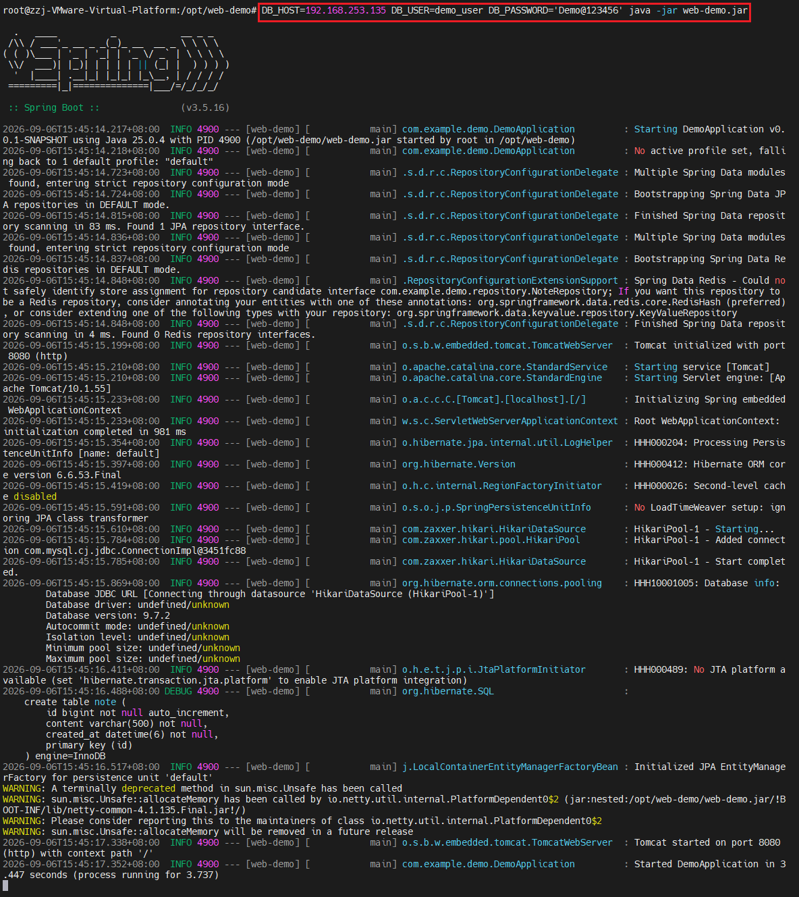

运行成功！

#### 添加nginx配置

把nginx.conf里的java部分解除注释

#### 重载nginx

```shell
nginx -t && systemctl reload nginx
```

访问nginx服务器http://192.168.253.136:80

发现后端连接失败？后端连接失败：请求失败（HTTP 502)


其实是Nginx联网反向代理没开

#### 开启Nginx联网反向代理

服务器3执行即可

```shell
setsebool -P httpd_can_network_connect 1
```

#### 验证

刷新网页

